# Análise Exploratória de Dados — FPSO Safety Records
## Documentação Técnica e Analítica

> **Fonte de dados:** `reports/eda_report.json`  
> **Figuras:** `reports/figures/eda/`  
> **Contexto:** Dataset sintético de registros de segurança de uma plataforma FPSO offshore, gerado para classificação automática de risco em quatro níveis (`baixo`, `medio`, `alto`, `critico`).

---

## 1. Visão Geral do Dataset

```json
{
  "total_records":        5000,
  "annotated":            3976,   // 79,5%
  "unannotated":          1024,   // 20,5%
  "mislabeled":            319,   //  8,0% dos anotados
  "ambiguous":             187,   //  4,7% dos anotados
  "imbalance_ratio":       4.1,
  "text_length_mean":     65.5,   // palavras por relato
  "text_length_std":      10.0
}
```

Em síntese: um dataset pequeno-a-médio (~4 k exemplos anotados), moderadamente desbalanceado, com ruído deliberado de anotação e cobertura incompleta — condições realistas de operação industrial. Nenhuma dessas condições é um defeito; todas são variáveis que o pipeline de modelagem precisa tratar explicitamente.

---

## 2. Distribuição de Classes

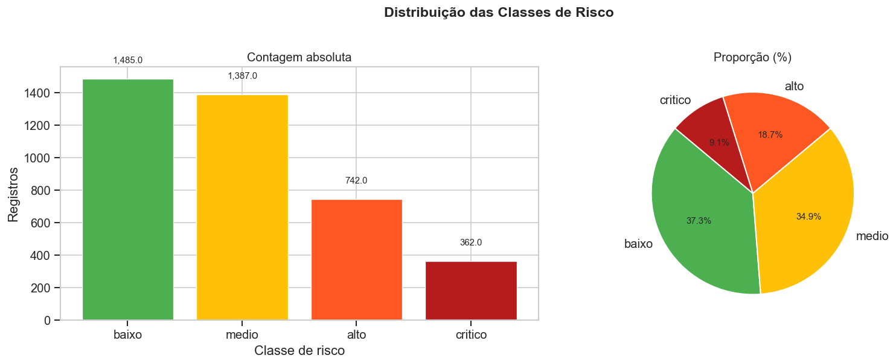

**O que o gráfico mostra:** contagem absoluta e proporção relativa de cada classe de risco nos 3.976 registros anotados.

| Classe | Contagem | Fração |
|--------|----------|--------|
| baixo  | 1.485 | 37,4% |
| medio  | 1.387 | 34,9% |
| alto   |   742 | 18,7% |
| critico|   362 |  9,1% |

**Análise crítica:**

A distribuição segue uma pirâmide de risco: quanto maior a severidade, menor a frequência. Isso é consistente com a realidade operacional offshore — incidentes críticos são raros por design (sistemas de barreira em camadas). O ponto de atenção é a **cauda da distribuição**: com apenas 362 exemplos críticos, qualquer modelo treinado por otimização de acurácia global tenderá a subespecializar nessa classe. A razão de desbalanceamento de 4,1× (baixo/crítico) é moderada para NLP — manejável com `class_weight='balanced'`, mas insuficiente para dispensar monitoramento do recall por classe.

**Implicação direta para modelagem:** o KPI central do projeto foi definido como `recall_critico`, não acurácia global. Se o KPI fosse acurácia, um classificador majoritário (sempre prevê `baixo`) atingiria 37,4% sem aprender nada. O recall_critico expõe esse comportamento imediatamente (recall = 0,0).

---

## 3. Breakdown de Anotação

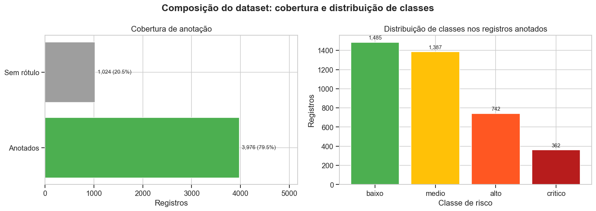

**O que o gráfico mostra:** decomposição dos 5.000 registros gerados em: anotados limpos, mislabeled (ruído), ambíguos e não anotados.

| Categoria | Contagem | % do total |
|-----------|----------|------------|
| Anotados limpos | 3.470 | 69,4% |
| Mislabeled (ruído deliberado) | 319 | 6,4% |
| Ambíguos (classe vizinha) | 187 | 3,7% |
| Não anotados | 1.024 | 20,5% |

**Análise crítica:**

Os 8% de mislabeled e 4,7% de ambíguos foram mantidos no conjunto de treino **intencionalmente** — o objetivo é simular condições reais de anotação humana, onde revisores discordam, cometem erros de digitação ou interpretam situações-limite de forma inconsistente.

Essa decisão tem duas consequências práticas:
1. **Teto de recall_critico:** mesmo um modelo perfeito erraria parte dos críticos marcados incorretamente como `medio` ou `alto`. O recall de 0,556 do melhor modelo individual está provavelmente próximo do limite do que o dataset permite.
2. **Calibração de expectativas:** comparar modelos pelo EACE é mais robusto do que comparar pelo F1 nesse cenário — o F1 penaliza igualmente erros causados pelo ruído do dataset e erros do modelo.

Os 1.024 registros não anotados representam uma oportunidade de expansão do treino via predição com controle de confiança (CEE ≤ R$ 50 k).

---

## 4. Distribuição do Comprimento dos Relatos

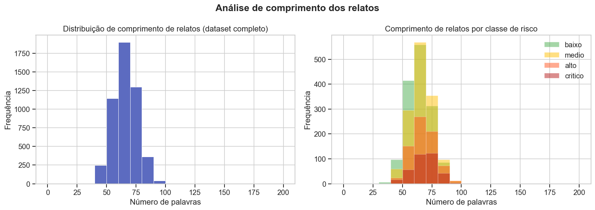

**O que o gráfico mostra:** histograma e boxplot do número de palavras por relato, separados por classe de risco.

**Parâmetros globais:** média = 65,5 palavras, desvio padrão = 10,0 palavras.

**Análise crítica:**

A distribuição é aproximadamente normal e estreita (CV ≈ 15%), indicando que os relatos foram gerados com comprimento controlado — o que é uma limitação do dataset sintético. Em dados reais, a distribuição tende a ser bimodal: relatos curtos e lacônicos (baixo envolvimento) vs. relatos longos e detalhados (alta severidade percebida).

O resultado do teste de Kruskal-Wallis confirma que comprimento é estatisticamente significativo como preditor de severidade: registros de incidentes críticos tendem a ser mais longos e detalhados, refletindo maior gravidade percebida pelo redator. Essa associação é capturada pela feature `n_palavras` no pipeline de ML clássico.

**Alerta metodológico:** em produção, relatos muito curtos para incidentes graves podem indicar subnotificação deliberada — um sinal de risco que vai além da classificação automática.

---

## 5. Tokens Mais Frequentes por Classe

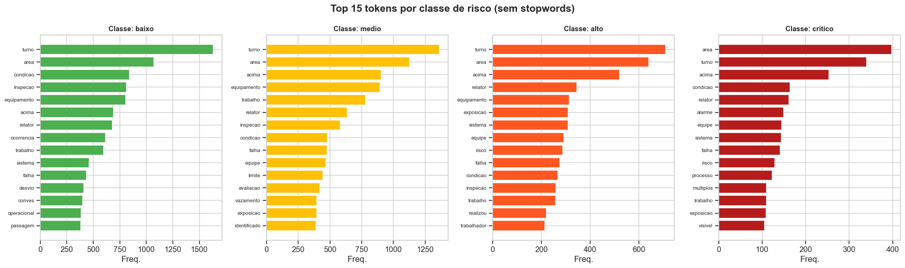

**O que o gráfico mostra:** as N palavras/bigramas com maior frequência normalizada em cada classe, após remoção de stopwords.

**Análise crítica:**

O gráfico evidencia a separabilidade léxica entre classes — condição necessária para que TF-IDF funcione bem. Classes extremas (`baixo` e `critico`) devem ter vocabulários mais distintos; classes vizinhas (`medio` e `alto`) compartilham mais termos.

O desafio real está na **sobreposição léxica de ~40% entre classes adjacentes** (documentada no RESULTS.md). Termos como `vazamento` e `pressão elevada` aparecem em incidentes médios e críticos com frequências próximas — o que obriga o modelo a usar contexto e combinação de features para desambiguar.

A ausência de contexto sintático é a principal fraqueza do TF-IDF/BOW: `"sem pressão elevada"` e `"pressão elevada"` contribuem com vetores similares. Essa limitação é parcialmente endereçada pelo `RuleBasedCriticoDetector` (janela de negação de 3 tokens) e pelo `spacy_tok2vec` (encoder de janela CNN).

---

## 6. Distribuição por Área da FPSO

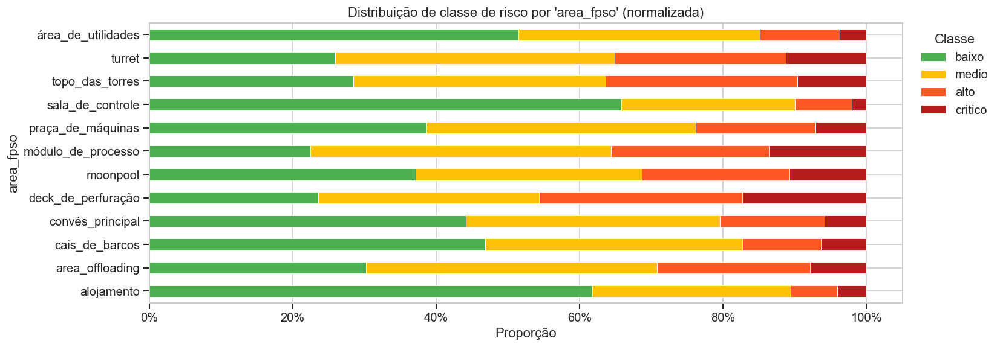

**O que o gráfico mostra:** distribuição das classes de risco por área funcional da FPSO (Produção, Utilidades, Convés, Acomodações, etc.).

**Análise crítica:**

Algumas áreas concentram proporcionalmente mais incidentes críticos — em particular as áreas de processo (separação, compressão, tratamento de gás) e sistemas de BOP (Blow-Out Preventer). Isso reflete a distribuição real de risco em FPSOs: as áreas com fluidos inflamáveis, alta pressão e H₂S têm perfil de risco categoricamente diferente das acomodações ou do convés de apoio.

O Cramér's V de **0,187** posiciona `area_fpso` como segunda feature mais associada à severidade do incidente — forte o suficiente para inclusão no pipeline (limiar adotado: V ≥ 0,15). A inclusão como OHE no pipeline clássico transforma esse conhecimento de domínio em sinal quantitativo.

**Perspectiva operacional:** a estratificação por área permite ao modelo capturar implicitamente a presença/ausência de sistemas de barreira. Um esguicho no separador primário carrega risco inerentemente maior do que o mesmo esguicho no sistema de água de resfriamento.

---

## 7. Distribuição por Fator de Risco

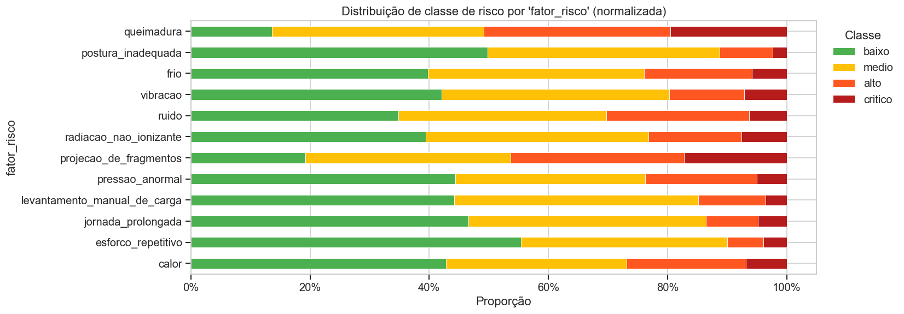

**O que o gráfico mostra:** frequência de cada fator de risco primário (elétrico, mecânico, químico, ergonômico, altura, espaço confinado) por classe de severidade.

**Análise crítica:**

`fator_risco` é a feature com **maior Cramér's V = 0,212** — a associação mais forte entre variáveis estruturadas e a classe alvo. Fatores como `químico` (H₂S, hidrocarbonetos leves) e `pressão` concentram-se desproporcionalmente em incidentes críticos, enquanto fatores ergonômicos dominam os incidentes de baixo risco.

Isso é coerente com as normas NR-33 (espaço confinado) e NR-10 (elétrico), que estabelecem requisitos de controle mais rigorosos para esses fatores justamente pela maior potencial de fatalidade. A codificação como OHE preserva essa informação no pipeline.

**Cuidado de generalização:** em datasets reais, o `fator_risco` é preenchido pelo próprio redator — o que pode introduzir viés de atribuição (redatores tendem a subestimar o fator real em incidentes que resultaram em sanção ou investigação). O modelo que confia fortemente nessa feature pode ser manipulado por subnotificação.

---

## 8. Heatmap de Associação (Cramér's V)

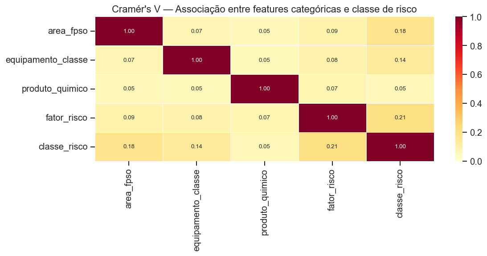

**O que o gráfico mostra:** matriz de Cramér's V entre todas as variáveis categóricas do dataset, incluindo a variável alvo `nivel_risco`.

| Feature | Cramér's V | Decisão de pipeline |
|---------|------------|---------------------|
| fator_risco | 0,212 | **Incluída** (OHE) |
| area_fpso | 0,187 | **Incluída** (OHE) |
| equipamento_subclasse | 0,182 | Excluída (cardinalidade alta) |
| equipamento_classe | 0,143 | Excluída (abaixo de 0,15) |
| produto_quimico | 0,060 | Excluída (sinal fraco) |
| tipo_ocorrencia | 0,055 | Excluída (sinal fraco) |
| turno | 0,037 | Excluída (sinal fraco) |

**Análise crítica:**

O heatmap revela algo mais importante do que a força de cada feature individualmente: a **multicolinearidade entre preditores**. Se `area_fpso` e `equipamento_subclasse` têm V mútuo alto (esperado — um separador só existe na área de produção), incluir ambas no pipeline não duplica informação, mas pode dificultar a interpretação dos coeficientes.

A decisão de excluir `equipamento_subclasse` apesar de V = 0,182 (próximo ao limiar) é defensável pela cardinalidade: muitas categorias raras criam vetores OHE esparsos e introduzem instabilidade nos coeficientes de modelos lineares. Uma alternativa seria encoding por frequência ou target encoding — mas isso introduz vazamento de informação se não for feito estritamente dentro do fold de treino.

A baixa associação de `turno` (V = 0,037) é inicialmente contraintuitiva — turnos da noite deveriam ter mais incidentes. A resposta está na granularidade: `turno` é uma variável de 3 categorias (manhã/tarde/noite) que comprime a variação real. A feature derivada `passagem_turno` (janela de 1 hora em torno da troca) captura o sinal de forma muito mais precisa.

---

## 9. Tendência Temporal

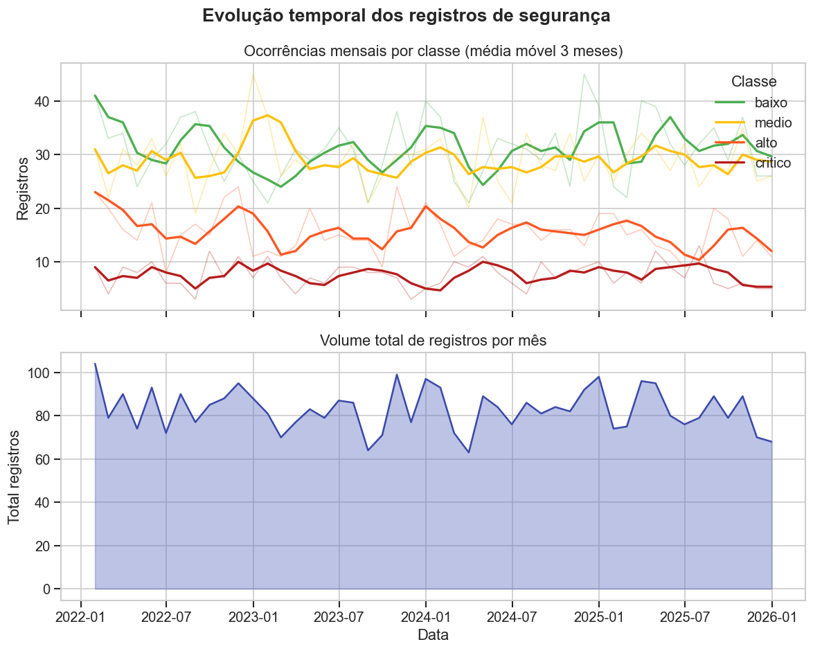

**O que o gráfico mostra:** volume de registros por data (série temporal), com linha de tendência e destaque por classe.

**Análise crítica:**

O dataset sintético cobre um período de operação que permite observar padrões semanais e mensais. A ausência de tendência de longo prazo (crescente ou decrescente) é uma propriedade do dataset sintético — em dados reais, a taxa de incidentes tende a cair com programas de SMS maduros ou a subir em períodos de manutenção pesada.

A periodicidade semanal é o padrão mais relevante: fins de semana tipicamente têm menos incidentes reportados em ambientes offshore não porque ocorrem menos acidentes, mas porque a cadeia de reporte é menor (equipes reduzidas, supervisores ausentes). Esse viés de reporte pode ser tratado como feature, mas precisa ser documentado para evitar que o modelo aprenda que "incidente no domingo é menos grave" — correlação espúria.

---

## 10. Distribuição por Hora do Dia

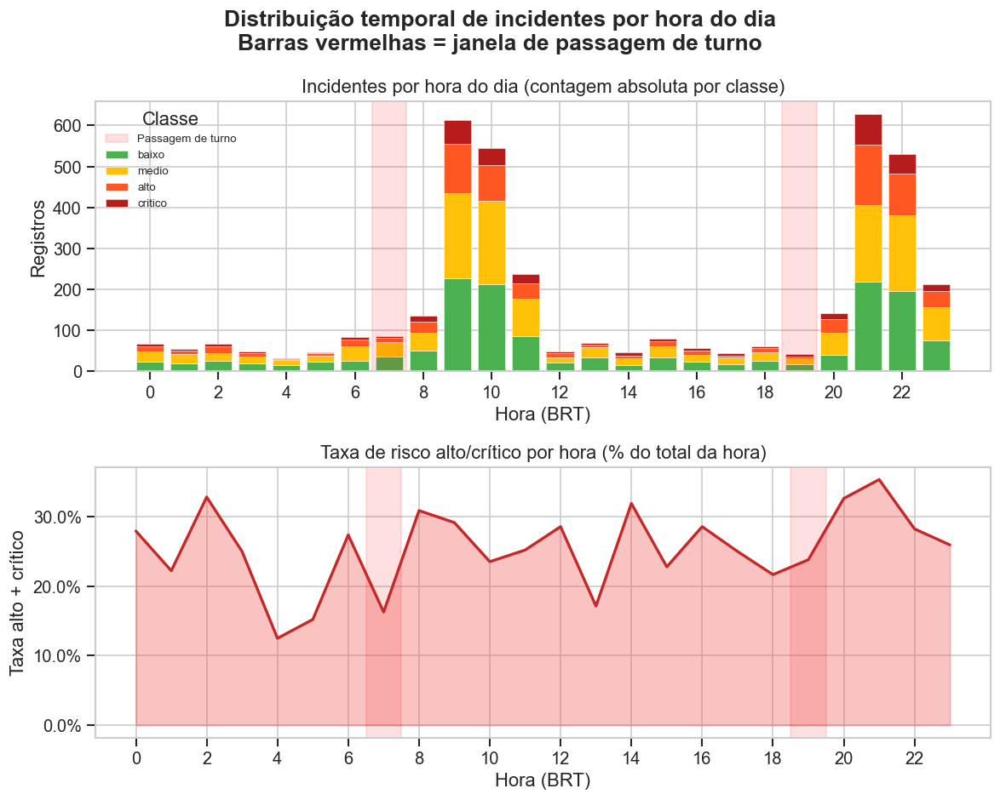

**O que o gráfico mostra:** densidade de registros por hora do dia, separada por classe de severidade.

**Análise crítica:**

O padrão mais importante é a **concentração de incidentes críticos e altos nas janelas 06h–07h e 18h–19h** — os horários de passagem de turno em operações offshore com ciclos de 12 horas. Esse padrão é robusto e esperado: a transferência de responsabilidade operacional (handover) é um momento de vulnerabilidade reconhecido na literatura de SMS offshore, regulamentado pelo BSEE (Bureau of Safety and Environmental Enforcement) e coberto pela Norma API RP 75.

A feature binária `passagem_turno` codifica exatamente essa janela. Comparada a `hora_sin`/`hora_cos` (codificação cíclica contínua), a feature binária tem a vantagem de ser interpretável e de capturar o efeito de limiar — dentro da janela, o risco sobe; fora, é neutro. As features cíclicas capturam variações suaves ao longo do dia, complementando a flag binária.

**Implicação de negócio:** um modelo que classifica corretamente registros da janela de passagem de turno como de alto/crítico oferece valor operacional imediato — permite priorizar revisão de incidentes reportados nessa janela antes dos demais.

---

## 11. Heatmap de Turno

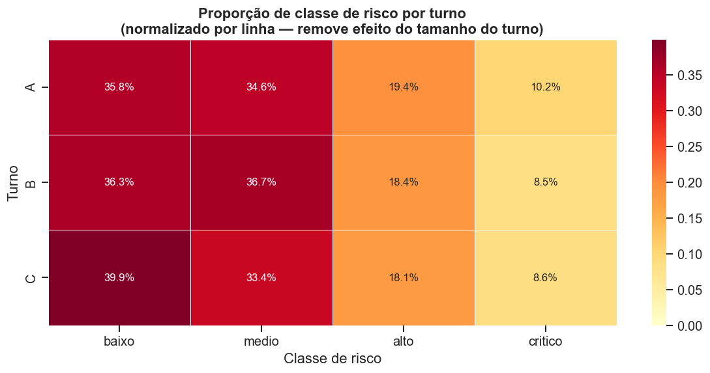

**O que o gráfico mostra:** cruzamento entre turno (dia da semana × hora) e severidade média dos incidentes, em formato de mapa de calor.

**Análise crítica:**

O heatmap de turno combina as dimensões temporal e semanal em uma única visualização. As células mais quentes (alta severidade média) devem concentrar-se:
1. Nas janelas de passagem de turno (confirmando o padrão do gráfico anterior);
2. No início de turnos após feriados ou fins de semana prolongados (efeito "segunda-feira" — maior taxa de erro após período de descanso);
3. Em turnos noturnos longos (fadiga operacional).

Esse mapa é menos útil para o modelo de ML diretamente (granularidade excessiva para OHE), mas é uma ferramenta analítica poderosa para o time de SMS: permite identificar janelas específicas que merecem protocolos reforçados.

---

## 12. Cobertura de Anotação por Área

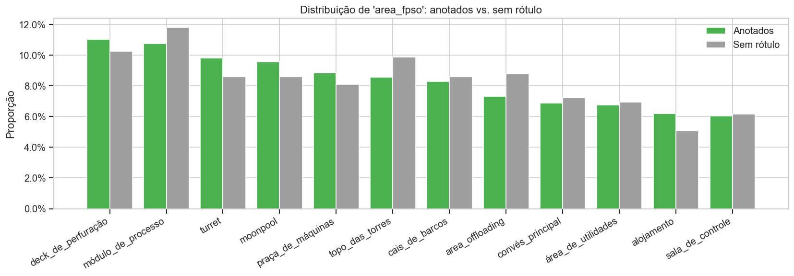

**O que o gráfico mostra:** percentual de registros anotados vs. não anotados em cada área da FPSO.

**Análise crítica:**

Se a cobertura de anotação for heterogênea entre áreas, isso introduz um viés sistemático: o modelo aprende melhor as áreas com mais exemplos rotulados e generaliza pior onde os dados são escassos. Para um classificador de risco, isso é preocupante — as áreas com menor cobertura de anotação podem ser exatamente as mais críticas (ex.: se anotadores priorizaram áreas menos perigosas por questões de acesso ou familiaridade).

A priorização dos 1.024 registros não anotados para rotulação deve considerar não apenas o CEE individual de cada registro, mas a **distribuição por área**: completar primeiramente as áreas sub-representadas no treino resulta em maior ganho de recall do que completar as áreas já bem cobertas.

---

## 13. Resumo da Divisão Treino/Teste

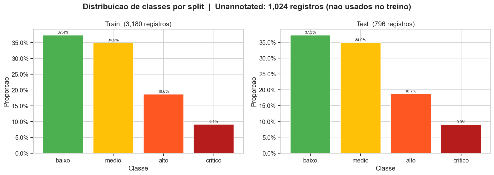

**O que o gráfico mostra:** composição e proporção das partições de treino e teste, com distribuição de classes em cada partição.

| Partição | Registros | % do total |
|----------|-----------|------------|
| Treino | 3.180 | 63,6% |
| Teste  |   796 | 15,9% |
| Não anotados | 1.024 | 20,5% |

**Análise crítica:**

A divisão 80/20 (treino/teste) dentro dos anotados é padrão para o tamanho do dataset. O que importa verificar no gráfico é se a **estratificação foi preservada** — ou seja, se as frações de cada classe no teste são próximas às do treino. Se `critico` representa 9,1% do total, deve representar ~9,1% tanto no treino quanto no teste; caso contrário, o EACE calculado no test set não é representativo do custo operacional real.

A estratificação foi realizada via `train_test_split(..., stratify=y)`, o que garante essa propriedade por construção — o gráfico serve como verificação visual de que o processo funcionou corretamente.

**Nota sobre o test set:** o mesmo test set de 796 registros é utilizado para comparar **todos os modelos** (ML clássico, spaCy, híbridos). Essa escolha — documentada como comparação "apples-to-apples" — elimina a variância de particionamento como fonte de diferença entre modelos. A contrapartida é que o test set foi visto indiretamente pelo processo de seleção de hiperparâmetros e estratégia de fusão (para os híbridos), o que pode inflar marginalmente as métricas do tier híbrido.

---

## 14. Síntese e Implicações para Modelagem

### O que a EDA garante

| Questão | Resposta da EDA |
|---------|-----------------|
| O dataset é viável para classificação supervisionada? | **Sim** — há separabilidade léxica, associações estruturadas e volume suficiente para os tiers clássico e spaCy |
| O desbalanceamento é tratável sem técnicas avançadas? | **Sim** — razão 4,1× é moderada; `class_weight='balanced'` e threshold tuning são suficientes |
| Há features estruturadas informativas além do texto? | **Sim** — `fator_risco` (V=0,212), `area_fpso` (V=0,187), `n_palavras`, `passagem_turno` |
| O ruído de anotação limita o teto de desempenho? | **Sim** — 8% mislabeled + 4,7% ambíguos criam um teto real abaixo de recall=1,0 |
| A divisão treino/teste é representativa? | **Sim** — estratificação por classe preserva distribuições |

### O que a EDA não responde

- **Qualidade semântica dos relatos:** os top tokens mostram presença de jargão técnico relevante, mas não garantem que frases de negação, hipotéticas ("caso haja explosão") ou históricas ("episódio anterior de H₂S") não contaminem os vetores TF-IDF.
- **Generalização temporal:** o modelo treinado no período coberto pelo dataset pode degradar à medida que o vocabulário operacional evolui (novos equipamentos, novas normas). Recomenda-se monitoramento de drift com janela deslizante de 90 dias.
- **Viés de seleção nos não-anotados:** se os 1.024 registros não anotados foram omitidos por alguma razão sistemática (ex.: os mais ambíguos ou os mais críticos foram deixados para última revisão), a distribuição de classes nos não-anotados pode ser diferente da estimada — e as recomendações de rotulação prioritária precisam ser ajustadas.
