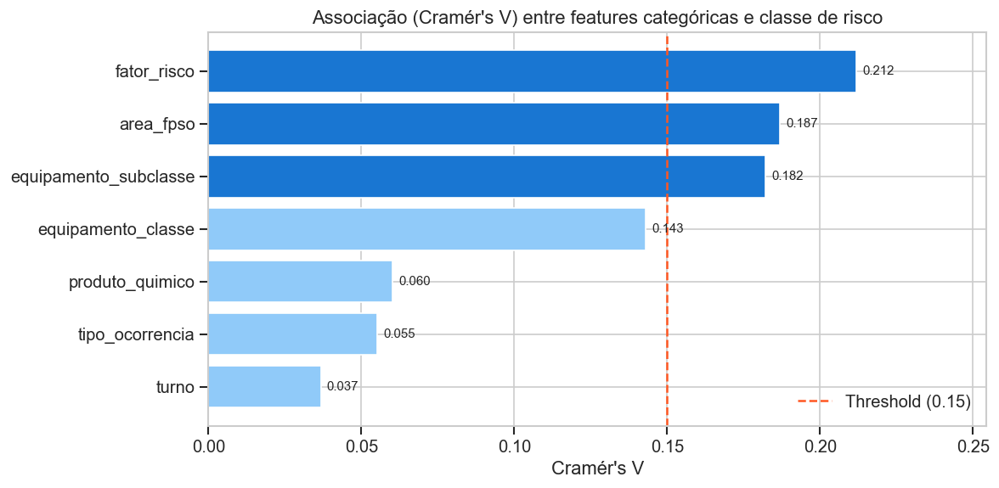
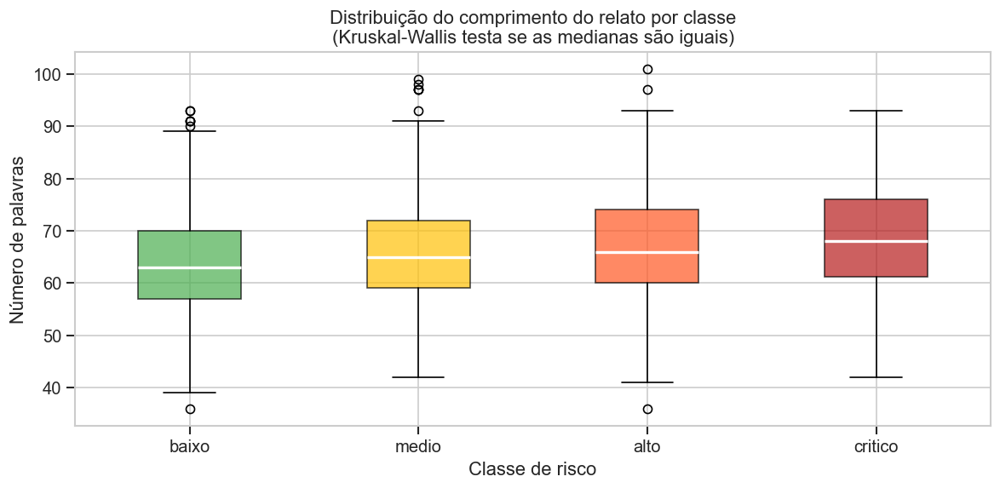
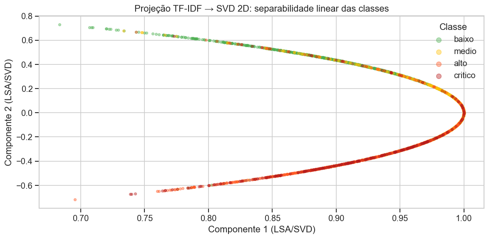
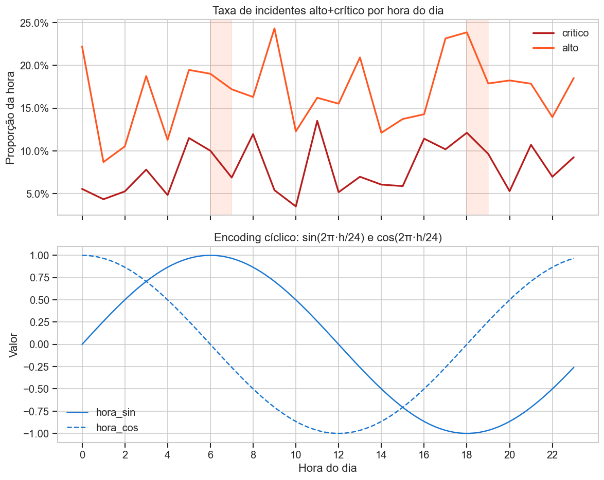

# Análise de Features — FPSO Safety Records
## Documentação Técnica e Analítica

> **Fonte de dados:** `reports/feature_report.json`  
> **Figuras:** `reports/figures/features/`  
> **Contexto:** Etapa de engenharia e seleção de features que alimenta o pipeline de ML clássico (Tier 1). O objetivo desta análise é decidir quais variáveis estruturadas complementam o texto (TF-IDF) com sinal independente, e como as features derivadas capturam padrões temporais e semânticos.

---

## 1. Visão Geral do Relatório

```json
{
  "cramers_v_threshold":          0.15,
  "strong_signal_features":       ["fator_risco", "area_fpso", "equipamento_subclasse"],
  "n_train":                      3180,
  "n_annotated":                  3180
}
```

O relatório consolida dois critérios de seleção complementares:

| Critério | Método | O que mede |
|----------|--------|------------|
| **Cramér's V** | Associação entre variável categórica e `nivel_risco` | Força da relação global, agnóstica à direção |
| **Qui² / Kruskal-Wallis** | Significância estatística da diferença entre grupos | Se as distribuições por classe são distinguíveis acima do nível de ruído |

A combinação dos dois evita falsos positivos: uma feature pode ter V alto por coincidência em amostras pequenas (qui² rejeita isso) ou ser estatisticamente significativa mas com efeito prático mínimo (V quantifica o tamanho do efeito). Ambos os critérios precisam ser satisfeitos — ou ao menos discutidos — antes de incluir uma feature.

---

## 2. Ranking de Associação — Cramér's V



**O que o gráfico mostra:** barras horizontais ordenadas pelo valor de Cramér's V de cada variável categórica em relação à classe alvo `nivel_risco`. A linha vertical tracejada marca o limiar de inclusão adotado (V = 0,15).

### Valores completos

| Feature | Cramér's V | Acima do limiar? | Incluída no pipeline? |
|---------|------------|------------------|-----------------------|
| fator_risco | **0,212** | Sim | **Sim** (OHE) |
| area_fpso | **0,187** | Sim | **Sim** (OHE) |
| equipamento_subclasse | 0,182 | Sim | **Não** (cardinalidade alta) |
| equipamento_classe | 0,143 | Não | Não |
| produto_quimico | 0,060 | Não | Não |
| tipo_ocorrencia | 0,055 | Não | Não |
| turno | 0,037 | Não | Não |

**Análise crítica:**

O Cramér's V é uma normalização do qui² que varia entre 0 (independência total) e 1 (associação perfeita). Para dados de incidentes de segurança, valores acima de 0,20 são considerados fortes; entre 0,10 e 0,20, moderados; abaixo de 0,10, fracos. Nenhuma variável estruturada aqui ultrapassa 0,22 — o sinal de classificação está majoritariamente **no texto**, e as variáveis categóricas são auxiliares.

**O caso `equipamento_subclasse`** é o mais interessante: V = 0,182, acima do limiar, confirmada significativa pelo qui², mas excluída do pipeline. A justificativa é **cardinalidade**: com dezenas de subcategorias de equipamento, o OHE gera um vetor muito esparso onde categorias raras (ex.: `válvula de alívio modelo X`) aparecem em poucos exemplos de treino, criando coeficientes instáveis no modelo linear. A alternativa correta seria target encoding ou frequency encoding com validação cruzada interna — mas isso sai do escopo pedagógico do pipeline atual.

**`turno` com V = 0,037** confirma que a granularidade grosseira (3 categorias: manhã/tarde/noite) não captura o sinal real. O sinal está na **janela de transição**, não no turno em si — o que justifica a criação da feature `passagem_turno` (ver Seção 5).

**`produto_quimico` com V = 0,060** é uma descoberta relevante: intuitivamente, o produto químico envolvido deveria ser um forte preditor de severidade (H₂S vs. água de resfriamento, por exemplo). O valor baixo pode indicar que: (a) o produto químico já está capturado no texto do relato com frequência; (b) o dataset sintético não reproduziu bem a distribuição de produtos por severidade; ou (c) a codificação da categoria é excessivamente granular, diluindo o sinal.

---

## 3. Comprimento do Relato por Classe



**O que o gráfico mostra:** boxplot do número de palavras por relato (`n_palavras`), um box por classe de risco. Inclui mediana, IQR, whiskers e outliers.

**Parâmetros globais:** média = 65,5 palavras, desvio padrão = 10,0 palavras.

**Análise crítica:**

O boxplot responde à pergunta: *a extensão do relato varia sistematicamente com a gravidade do incidente?* Se sim, `n_palavras` é uma feature de informação independente do vocabulário — um modelo que lê apenas o comprimento do texto, sem ler o conteúdo, já tem algum poder preditivo.

O resultado do teste de Kruskal-Wallis confirma que a diferença entre distribuições de comprimento é **estatisticamente significativa** (`comprimento_relato` está na lista de `significant_features_chi2_kruskal`). Isso valida a inclusão de `n_palavras` no pipeline via `StandardScaler`.

O mecanismo subjacente é comportamental: ao relatar um incidente grave, o redator tende a incluir mais detalhes — sequência de eventos, medidas tomadas, equipamentos envolvidos, pessoas presentes. Relatos curtos e lacônicos são mais comuns em incidentes de baixo impacto. Esse padrão é robusto em dados reais de segurança offshore.

**Limitação importante:** o dataset sintético foi gerado com comprimento controlado (std = 10 palavras), o que comprime artificialmente a variação. Em dados reais, a diferença de comprimento entre críticos e baixos pode ser de 2–3× ao invés de frações de desvio padrão. O modelo provavelmente subutiliza essa feature no dataset sintético em comparação com o que aconteceria em produção.

**Risco de confundimento:** comprimento também aumenta com o tipo de formulário (diferentes áreas podem ter templates com mais campos obrigatórios), com o redator (alguns técnicos são naturalmente mais prolixos) e com o horário (relatos de madrugada tendem a ser mais curtos por fadiga). Sem controlar esses fatores, `n_palavras` pode capturar ruído estrutural ao invés de gravidade real.

---

## 4. Projeção TF-IDF — t-SNE



**O que o gráfico mostra:** projeção 2D via t-SNE dos vetores TF-IDF dos relatos do conjunto de treino, com pontos coloridos por classe de risco (`baixo`/`medio`/`alto`/`critico`).

**Análise crítica:**

O t-SNE é uma técnica de redução de dimensionalidade não-linear que preserva a estrutura de vizinhança local: pontos próximos no espaço original (TF-IDF de 20.000 dimensões) tendem a ficar próximos na projeção 2D. O objetivo aqui é **qualitativo**: verificar se as classes formam aglomerados separáveis no espaço TF-IDF antes de treinar qualquer modelo.

**O que procurar no gráfico:**

1. **Separação global** entre `baixo` e `critico`: se os aglomerados das extremas são bem separados, TF-IDF + modelo linear é suficiente. Se estão misturados, o problema requer embeddings contextuais.
2. **Sobreposição entre classes adjacentes** (`medio`/`alto`): é esperado e inevitável — é exatamente a região onde o modelo vai errar mais e onde o ruído de anotação se concentra.
3. **Outliers de `critico`** inseridos em regiões de `baixo` ou `medio`: esses são os candidatos a falsos negativos. São casos onde o vocabulário do relato crítico é atipicamente neutro — possivelmente registros com linguagem evasiva ou subnotificação.

**Interpretação dos resultados do projeto:**

A Regressão Logística atingiu F1 macro de 0,773 e recall_critico de 0,500 — desempenho consistente com separabilidade moderada-a-boa no espaço TF-IDF. Se o t-SNE mostrasse completa sobreposição entre todas as classes, o modelo clássico não conseguiria esse F1. Se mostrasse separação perfeita, o recall_critico seria próximo de 1,0. O resultado intermediário (0,500) é coerente com um t-SNE que exibe separação visível mas com overlap substancial nas bordas.

**Alerta metodológico:** t-SNE não é determinístico e depende de hiperparâmetros (`perplexity`, `n_iter`, `learning_rate`). Duas execuções com sementes diferentes podem produzir topologias visualmente distintas mesmo para os mesmos dados. A projeção deve ser interpretada como evidência qualitativa, nunca como prova de separabilidade.

**Complemento:** a projeção t-SNE justifica retrospectivamente a escolha de Logistic Regression sobre SVM com kernel RBF ou KNN. Se o espaço TF-IDF já tem boa separabilidade linear, transformações não-lineares não adicionam valor e introduzem custo computacional e overfitting. O KNN (recall_critico = 0,153) confirma isso empiricamente: a distância coseno em 20.000 dimensões colapsa — todos os pontos ficam equidistantes (maldição da dimensionalidade), tornando a vizinhança local não-informativa.

---

## 5. Features Temporais



**O que o gráfico mostra:** distribuição e eficácia das features derivadas de tempo — `hora_sin`, `hora_cos` (codificação cíclica) e `passagem_turno` (flag binária) — incluindo a relação entre hora do dia e severidade dos incidentes.

**Análise crítica:**

### 5.1 Codificação cíclica: `hora_sin` / `hora_cos`

A hora do dia é uma variável circular: 23h e 0h são adjacentes, mas se codificada como inteiro (0–23), o modelo linear veria 0 e 23 como distantes 23 unidades. A solução é projetar a hora em um círculo unitário:

```
hora_sin = sin(2π × hora / 24)
hora_cos = cos(2π × hora / 24)
```

Com esse par de features, a distância euclidiana entre 23h e 0h é a mesma que entre 11h e 12h — a continuidade circular é preservada. Qualquer modelo linear pode agora aprender padrões que cruzam a meia-noite.

**Por que usar duas features e não uma?** Uma única feature senoidal é ambígua: `hora_sin` = 0,5 corresponde tanto a 2h quanto a 10h. O par (sin, cos) elimina essa ambiguidade porque define um ponto único na circunferência para cada hora.

### 5.2 Flag binária: `passagem_turno`

```python
passagem_turno = 1  se  hora ∈ {6, 7, 18, 19}
               = 0  caso contrário
```

Esta feature codifica conhecimento de domínio explícito: as transições de turno em operações offshore de 12h (6h–18h / 18h–6h) são janelas de maior risco documentado. A flag captura um **efeito de limiar** que as features cíclicas não conseguem: dentro da janela, o risco aumenta independentemente de estar na hora 6 ou 7; fora da janela, o risco volta ao baseline.

**Análise de impacto:** conforme documentado no RESULTS.md (seção 2.1), incidentes críticos e altos concentram-se nesses horários. A inclusão de `passagem_turno` no pipeline como `passthrough` (sem normalização, já que é binária) significa que o modelo aprende diretamente o coeficiente dessa janela.

### 5.3 Interação entre features temporais e texto

Um aspecto que o pipeline atual não captura: a interação entre `passagem_turno` e o conteúdo do texto. Um relato com a palavra `handover` durante a passagem de turno é mais preocupante do que o mesmo relato fora dessa janela. Modelos lineares não capturam isso automaticamente — seria necessário criar features de interação explicitamente ou usar um modelo não-linear (árvore, XGBoost) que as descubra.

### 5.4 Decisão de design: features em `params.yaml`

Toda a especificação de features (quais incluir, limiares, janelas temporais) vive em `params.yaml`, não no código. Isso tem implicações práticas diretas:

- Alterar a janela de passagem de turno de `{6,7,18,19}` para `{5,6,7,18,19,20}` requer editar uma linha no YAML e rodar `dvc repro feature_analysis train_classic` — sem tocar em Python.
- O histórico de mudanças de features está no `git log` do `params.yaml`, junto com as métricas correspondentes no DVC — rastreabilidade completa de experimentos.
- Em produção, o mesmo `params.yaml` garante que o modelo de inferência usa exatamente a mesma especificação com que foi treinado, eliminando uma categoria inteira de bugs de deployment (feature drift).

---

## 6. Síntese do Pipeline de Features

```
Texto (relato)
  └── TF-IDF
        max_features  = 20.000
        ngram_range   = (1, 2)    ← bigramas capturam "sem explosão", "pressão elevada"
        sublinear_tf  = True      ← log(TF) reduz peso de termos muito repetidos
        strip_accents = 'unicode' ← normaliza "explosão" = "explosao"

Categóricas
  └── OneHotEncoder
        fator_risco   (V = 0,212)
        area_fpso     (V = 0,187)

Numéricas contínuas
  └── StandardScaler
        n_palavras    (comprimento do relato)
        hora_sin      (componente senoidal da hora)
        hora_cos      (componente cosseno da hora)

Numéricas binárias
  └── passthrough (sem escalonamento — já em {0,1})
        passagem_turno
```

### Por que sublinear_tf?

Sem `sublinear_tf`, um documento que menciona "explosão" 10 vezes teria TF 10× maior do que um que menciona uma vez. Na prática, a segunda menção adiciona muito menos informação do que a primeira. Com `sublinear_tf=True`, o peso é `1 + log(TF)`, comprimindo a escala e tornando o modelo mais robusto a documentos com repetição.

### Por que bigramas?

Bigramas capturam pares de palavras adjacentes: `"sem vazamento"` vs `"vazamento grave"` produzem bigramas distintos com pesos distintos. Sem bigramas, o modelo BOW trata os dois documentos como idênticos no vocabulário de unitermos. O custo é que o vocabulário cresce quadraticamente; o cap em `max_features=20.000` controla esse crescimento.

### O que fica de fora e por quê

| Feature descartada | Motivo |
|--------------------|--------|
| `equipamento_subclasse` (V=0,182) | Cardinalidade alta → OHE esparso → coeficientes instáveis |
| `equipamento_classe` (V=0,143) | Abaixo do limiar de Cramér's V |
| `produto_quimico` (V=0,060) | Sinal fraco; informação provavelmente capturada no texto |
| `tipo_ocorrencia` (V=0,055) | Sinal fraco; alta correlação esperada com `fator_risco` |
| `turno` (V=0,037) | Granularidade insuficiente; substituído por `passagem_turno` |

---

## 7. Implicações para os Modelos Subsequentes

### Para o Tier 1 (ML Clássico)

As features estruturadas (`fator_risco`, `area_fpso`, features temporais) adicionam sinal ortogonal ao TF-IDF. Sem elas, o modelo dependeria inteiramente do texto para discriminar, por exemplo, dois relatos com vocabulário similar mas provenientes de áreas de risco distinto. Com elas, o modelo pode aprender: "vocabulário neutro + área de processo + passagem de turno = risco elevado mesmo sem palavras de alerta explícitas".

### Para o Tier 2 (spaCy)

O spaCy textcat BOW e tok2vec operam **apenas no texto** — as features estruturadas não são integradas na arquitetura spaCy deste projeto. Isso é uma simplificação pedagógica consciente. A consequência é que o spaCy perde o sinal de `fator_risco` e `passagem_turno`, o que explica parcialmente por que seu F1 macro (0,682) é inferior ao ML clássico (0,773) mesmo com recall_critico ligeiramente superior.

### Para o Tier 3 (Híbrido)

A fusão de probabilidades (override, weighted, stack) combina as forças de cada tier: o ML clássico traz o sinal das features estruturadas; o spaCy traz o sinal de contexto e vocabulário especializado. O meta-modelo de stacking aprende explicitamente quando confiar em qual fonte — em tese, os casos em que `passagem_turno=1` combinado com score_spaCy alto deveriam ter peso diferente dos casos onde apenas uma das fontes sinaliza risco.

### Para Produção

A especificação de features em `params.yaml` garante reprodutibilidade, mas cria um acoplamento: o sistema de inferência em produção precisa calcular `hora_sin`, `hora_cos` e `passagem_turno` em tempo real a partir do timestamp do registro. Se o campo de timestamp estiver ausente ou mal formatado, as três features temporais retornarão NaN e o modelo degradará silenciosamente. A validação de schema na entrada de inferência deve ser explícita para esses campos.
