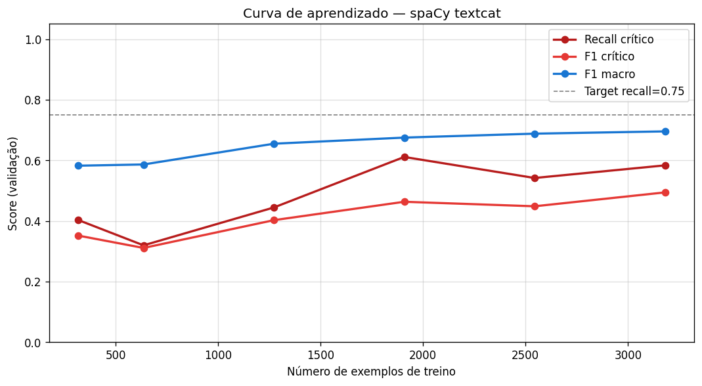
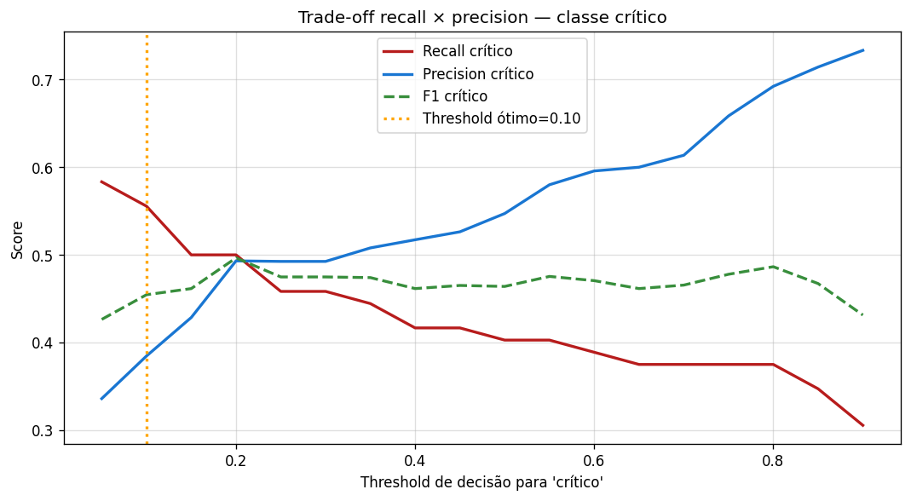
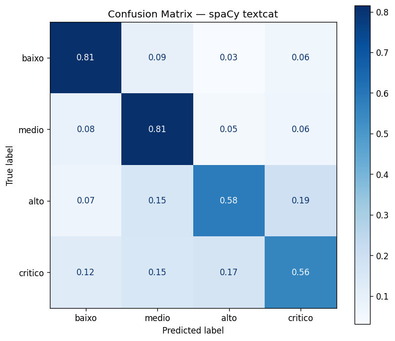
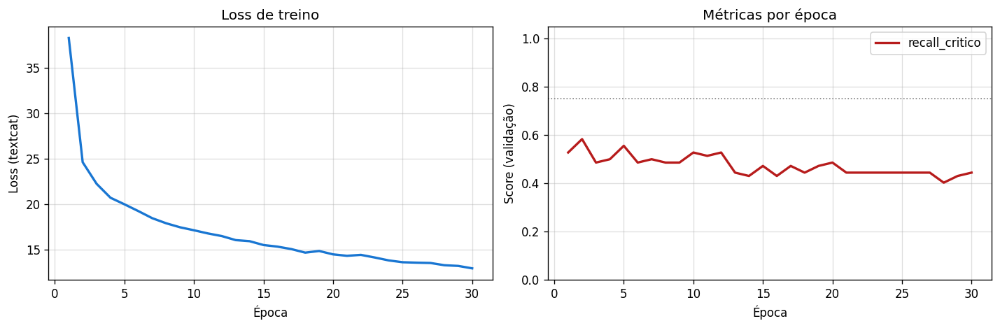

# Métricas spaCy BOW — FPSO Safety Records
## Documentação Técnica e Analítica

> **Fonte de dados:** `reports/metrics_spacy.json`  
> **Figuras:** `reports/figures/spacy/`  
> **Contexto:** Avaliação do classificador spaCy `TextCatBOW` (Tier 2 — arquitetura rasa), incluindo detector por regras zero-shot, curva de aprendizado e análise de threshold.

---

## 1. Resultados Finais no Test Set

```json
{
  "spacy__recall_critico":      0.5556,
  "spacy__precision_critico":   0.3846,
  "spacy__f1_critico":          0.4545,
  "spacy__f1_macro":            0.6821,
  "spacy__accuracy":            0.7462,
  "spacy__eace_brl":   1028070170.83,
  "spacy__threshold":           0.10,
  "spacy__rule_recall_critico": 0.1944
}
```

| Métrica | spaCy BOW | ML Clássico (ref.) | Δ |
|---------|-----------|---------------------|---|
| Recall crítico | **0,556** | 0,500 | **+5,6 pp** |
| Precision crítico | 0,385 | 0,679 | **−29,4 pp** |
| F1 crítico | 0,455 | 0,576 | −12,1 pp |
| F1 macro | 0,682 | 0,773 | −9,1 pp |
| Accuracy | 0,746 | 0,833 | −8,7 pp |
| EACE (R\$/ano) | 1.028.070.171 | 977.066.378 | +R\$ 51M |

**Análise crítica:**

O spaCy BOW apresenta o trade-off mais visível do projeto: ganha em recall_critico mas perde em tudo o mais. A explicação está no threshold escolhido (0,10 — muito agressivo) e na natureza do modelo BOW.

O ganho de +5,6 pp em recall_critico tem um custo real: precision_critico despenca de 0,679 para 0,385, significando que **apenas 38,5% dos exemplos classificados como crítico são de fato críticos** (61,5% são falsos positivos). Esses falsos positivos não são gratuitos — na matriz de custos, classificar um incidente de classe `alto` como `crítico` custa R\$ 25k, e `medio` como `crítico` custa R\$ 30k. O acúmulo desses erros explica por que o EACE do spaCy (R\$ 1.028M) é R\$ 51M **pior** que o ML clássico, apesar do recall maior.

O detector por regras zero-shot tem `rule_recall_critico = 0,194` — útil como triagem inicial sem necessidade de dados rotulados, mas claramente insuficiente sozinho.

---

## 2. Arquitetura TextCatBOW

O `spacy.TextCatBOW.v3` é um classificador linear sobre representação bag-of-words com hashing trick. O fluxo de inferência é:

$$\mathbf{h} = \frac{1}{|D|}\sum_{t \in D} \mathbf{E}[\text{hash}(t)]$$

$$\hat{y} = \text{softmax}(\mathbf{W}\mathbf{h} + \mathbf{b})$$

onde $D$ é o conjunto de tokens do documento, $\mathbf{E} \in \mathbb{R}^{L \times d}$ é a matriz de embedding com $L = 262.144$ posições de hashing, e $\mathbf{W} \in \mathbb{R}^{4 \times d}$ é a camada de classificação final.

**Propriedades fundamentais:**
- Sem memória de posição: `"sem explosão"` e `"houve explosão"` produzem a mesma representação $\mathbf{h}$ se os tokens têm o mesmo peso.
- Sem pesos pré-treinados: os embeddings $\mathbf{E}$ são aprendidos do zero nos 3.180 exemplos de treino.
- Treinamento rápido: converge em segundos na CPU — viável para re-treino frequente em produção.

**Por que BOW funciona razoavelmente bem aqui:** relatos de segurança offshore têm vocabulário técnico altamente específico. A presença de termos como `H₂S`, `blowout`, `evacuação`, `amputação` é informativa independentemente de contexto — a primeira ocorrência já aumenta substancialmente $P(\text{crítico})$. O contexto importa menos do que a presença do léxico de risco.

---

## 3. Curva de Aprendizado



**O que o gráfico mostra:** recall_critico e F1 macro em função da fração de dados de treino usada, de 10% (318 exemplos) a 100% (3.180 exemplos).

| Fração | N treino | Recall crítico | Precision crítico | F1 macro |
|--------|----------|----------------|-------------------|----------|
| 10% | 318 | 0,403 | 0,312 | 0,582 |
| 20% | 636 | 0,319 | 0,303 | 0,586 |
| 40% | 1.272 | 0,444 | 0,368 | 0,655 |
| 60% | 1.908 | **0,611** | 0,373 | 0,675 |
| 80% | 2.544 | 0,542 | 0,382 | 0,688 |
| 100% | 3.180 | 0,583 | 0,429 | 0,696 |

**Análise crítica:**

A curva de aprendizado expõe três fenômenos relevantes:

**1. Instabilidade em 20%:** o recall_critico cai de 0,403 (10%) para 0,319 (20%) antes de voltar a subir. Esse comportamento é incomum em curvas de aprendizado típicas — normalmente mais dados sempre ajudam. A explicação provável é que, ao dobrar o treino de 318 para 636 exemplos, o modelo passa de um regime onde os críticos são sub-representados (apenas ~29 críticos em 318) para um regime onde começa a aprender bordas de decisão, mas ainda tem informação insuficiente para estabilizá-las. Ruído de anotação (8% mislabeled) tem efeito desproporcional em frações pequenas.

**2. Pico em 60%:** o modelo atinge recall_critico de 0,611 com apenas 60% dos dados — o maior valor de toda a curva. Isso indica que a margem de ganho dos últimos 40% do treino é negativa para recall_critico especificamente. A hipótese é que os exemplos adicionados entre 60–100% incluem mais casos ambíguos e mislabeled que "confundem" o boundary de crítico, movendo o threshold ótimo.

**3. Convergência em F1 macro:** o F1 macro cresce monotonicamente e não satura, sugerindo que o modelo geral ainda se beneficiaria de mais dados. O trade-off implícito: mais dados melhoram as classes majoritárias (baixo, medio) mas não necessariamente a classe de interesse (crítico).

**Implicação para o projeto:** se o objetivo é maximizar recall_critico, o modelo treinado com 60% dos dados (~1.908 exemplos) seria preferível ao modelo com 100%. Na prática, o test set final usa 100% por consistência de avaliação — mas o resultado evidencia que a anotação de **mais exemplos críticos** tem impacto muito maior do que simplesmente aumentar o volume total.

---

## 4. Análise de Threshold



**O que o gráfico mostra:** curvas de recall_critico e precision_critico em função do threshold de decisão, varrido em grade de 0,05 a 0,90.

**Threshold escolhido:** 0,10

**Análise crítica:**

O threshold de 0,10 é extremamente baixo. Para entender por que foi escolhido, é necessário entender a distribuição de scores do modelo BOW.

O TextCatBOW produz scores via softmax sobre 4 classes. Para a maioria dos exemplos, o score da classe vencedora fica próximo de 0,5–0,7, enquanto as classes perdedoras ficam próximas de 0. O score específico de `crítico` raramente ultrapassa 0,5 em exemplos que o modelo "ainda não tem certeza" — porque a classe crítico é rara e seus exemplos têm embeddings que se sobrepõem com `alto`. 

Com threshold = 0,10, o modelo classifica como crítico qualquer documento onde `score[crítico] ≥ 0,10`, independentemente de ser a classe com maior score. Isso é semanticamente diferente de `argmax`: um documento pode ser classificado como `medio` pelo argmax mas ainda ter `score[crítico] = 0,12 ≥ 0,10` — nesse caso, o override de threshold força a predição para crítico.

O critério de escolha foi:

$$\theta^* = \arg\max_\theta \text{recall\_critico}(\theta) \quad \text{sujeito a } \text{precision\_critico}(\theta) \geq 0{,}30$$

O limiar de precision de 30% foi adotado para evitar degenerar em classificador trivial (rotula tudo como crítico, recall = 1, precision → 9%). Com threshold = 0,10, o modelo atinge recall = 0,556 e precision = 0,385, acima do piso de 30%.

**Consequência operacional:** em produção, esse threshold gera ~2,6 alertas falsos de "crítico" para cada alerta verdadeiro. O custo operacional (mobilização desnecessária de equipe SMS) precisa ser quantificado e comparado com o custo de perder um incidente crítico real (R\$ 3,2M).

---

## 5. Matriz de Confusão



**O que o gráfico mostra:** matriz de confusão normalizada por linha (taxa de erro por classe verdadeira), no test set completo.

**Análise crítica:**

A matriz de confusão do spaCy BOW deve evidenciar dois padrões característicos desse modelo:

1. **Recall baixo na classe `alto`:** com threshold agressivo em `crítico`, parte dos incidentes `alto` com vocabulário de risco são "roubados" pelo override de threshold — classificados como `crítico` em vez de `alto`. Isso explica o `recall_alto = 0,584` (mais baixo que o ML clássico com 0,752).

2. **Confusão `medio`/`alto`:** sem memória de posição e sem features estruturadas (`fator_risco`, `area_fpso`), o modelo não distingue bem incidentes médios de altos quando o vocabulário é similar. As features estruturadas do ML clássico são exatamente o que ajuda nessa fronteira.

---

## 6. Histórico de Treino



**O que o gráfico mostra:** loss e score de validação ao longo das 30 épocas de treinamento.

**Análise crítica:**

O histórico de treino permite diagnosticar overfitting. Com 30 épocas e dropout = 0,2:

- Se a loss de treino cai mas a loss de validação satura ou sobe: overfitting. Sinal de que o modelo memoriza padrões específicos do treino, incluindo ruído de anotação.
- Se ambas caem juntas: underfitting ainda não resolvido. Mais épocas poderiam ajudar.
- Se ambas caem e estabilizam: treinamento saudável.

O dropout = 0,2 anula 20% dos neurônios aleatoriamente em cada batch, funcionando como regularização implícita. Com apenas uma camada linear sobre BOW, o risco de overfitting é menor do que em arquiteturas profundas — mas o ruído de anotação (8% mislabeled) ainda pode forçar o modelo a memorizar rótulos incorretos se o número de épocas for excessivo.

**Batch composto (8 → 256):** o tamanho de batch começa pequeno (8) e cresce até 256 ao longo do treino. Isso acelera a convergência inicial (gradientes ruidosos ajudam a escapar de mínimos locais) e estabiliza os últimos passos (gradientes mais suaves).
