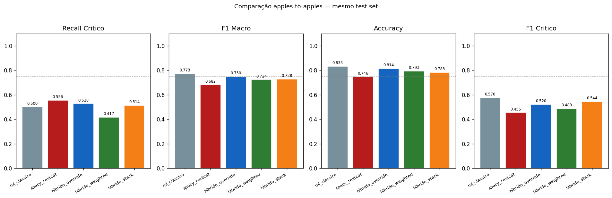
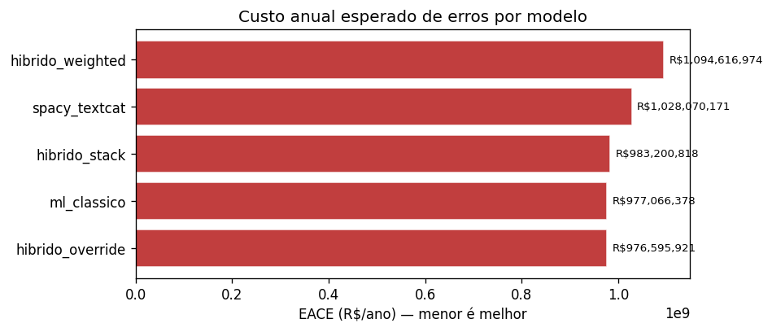
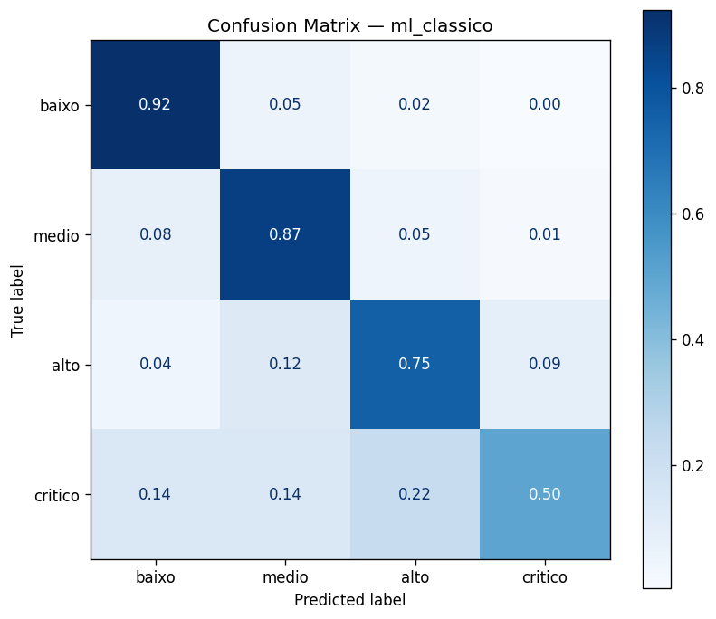
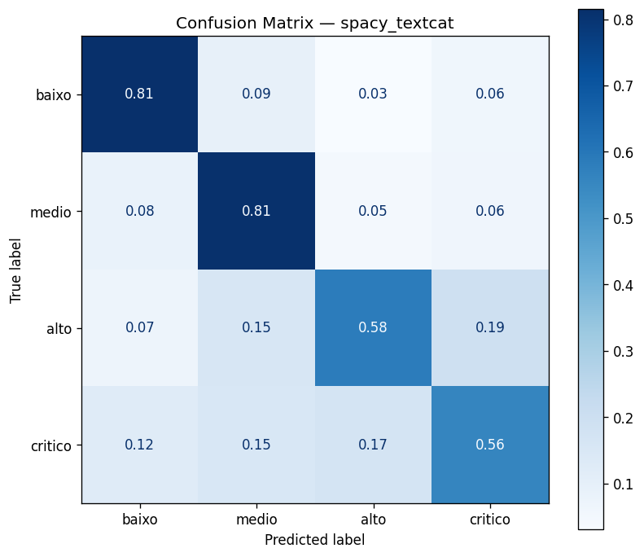
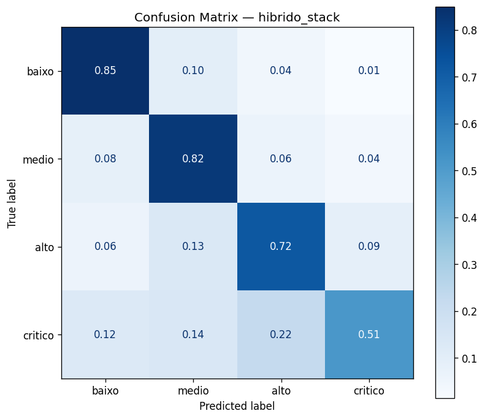

# Métricas — Híbrido Duplo (ML + spaCy BOW)
## Documentação Técnica e Analítica

> **Fontes de dados:** `reports/metrics_hybrid.json` · `reports/hybrid_selection_report.json`  
> **Figuras:** `reports/figures/hybrid/`  
> **Contexto:** Comparação apples-to-apples de três estratégias de fusão entre ML Clássico (LogReg + TF-IDF) e spaCy BOW. Todos os sistemas são avaliados no **mesmo test set** de 796 registros com as **mesmas métricas**.

---

## 1. O Que é um Modelo Híbrido?

Um modelo híbrido combina as predições de dois ou mais modelos base para produzir uma predição final. A motivação é aproveitar **complementaridade**: se dois modelos erram em exemplos diferentes, uma combinação inteligente pode errar menos do que qualquer um sozinho.

Neste projeto, os dois modelos base do Híbrido Duplo são:
- **ML Clássico** (`logistic_regression`): texto via TF-IDF + features estruturadas (`fator_risco`, `area_fpso`, `passagem_turno`, `n_palavras`). Saída: vetor de probabilidades $\mathbf{p}^{\text{ML}} \in \Delta^3$ (simplex de 4 classes).
- **spaCy BOW** (`TextCatBOW`): texto via bag-of-words com hashing. Saída: vetor de scores $\mathbf{s}^{\text{BOW}} \in [0,1]^4$.

As três estratégias diferem em **como** esses dois sinais são combinados.

---

## 2. As Três Estratégias de Fusão — Diferenças Detalhadas

### 2.1 Override

**Mecanismo:**

$$\hat{y} = \begin{cases} \text{crítico} & \text{se } s^{\text{BOW}}_{\text{crítico}} \geq 0{,}40 \\ \arg\max_k p^{\text{ML}}_k & \text{caso contrário} \end{cases}$$

**Interpretação:** o spaCy BOW funciona como um **alarme de risco**: quando o score de crítico do BOW ultrapassa 0,40, a predição é forçada para crítico, ignorando completamente o ML clássico. Abaixo do threshold, o ML clássico decide sozinho.

**Pressupostos implícitos:**
- $s^{\text{BOW}}_{\text{crítico}} \geq 0{,}40$ é um sinal de alta confiança — o modelo BOW raramente atinge esse patamar por acaso (dado que o threshold de decision do BOW já é 0,10).
- O ML clássico é suficientemente bom para os casos restantes — sua acurácia geral é 83,3%.

**Quando ativa:** somente quando o BOW detecta léxico de risco crítico com score alto. É uma estratégia conservadora no sentido de que mantém o ML clássico como padrão e só o sobrescreve em casos de alta confiança do BOW.

**Ponto cego:** o override não usa a probabilidade do ML clássico. Um caso onde $p^{\text{ML}}_{\text{crítico}} = 0{,}49$ (quase crítico pelo ML) + $s^{\text{BOW}}_{\text{crítico}} = 0{,}39$ (quase suficiente pelo BOW) é tratado da mesma forma que $p^{\text{ML}}_{\text{crítico}} = 0{,}05$ + $s^{\text{BOW}}_{\text{crítico}} = 0{,}39$ — o ML é ignorado quando o BOW não atinge o threshold.

---

### 2.2 Weighted (Média Ponderada)

**Mecanismo:**

$$\hat{y} = \arg\max_k \left( 0{,}4 \cdot p^{\text{ML}}_k + 0{,}6 \cdot s^{\text{BOW}}_k \right)$$

**Interpretação:** os dois sinais são combinados linearmente com pesos fixos (40% ML, 60% BOW) para cada classe, e o argmax da combinação decide.

**Pressupostos implícitos:**
- Os scores $\mathbf{p}^{\text{ML}}$ e $\mathbf{s}^{\text{BOW}}$ estão na **mesma escala** e têm **calibração comparável**.
- 60% de peso para o BOW é uma escolha que prioriza ligeiramente o recall (BOW tem recall_critico maior) sobre a precisão.

**Por que é a pior estratégia aqui:**

O pressuposto de calibração é violado. O LogReg produz probabilidades via softmax — bem calibradas, com distribuição suave entre 0 e 1. O BOW também usa softmax, mas com threshold ajustado para 0,10: seus scores de `crítico` são frequentemente baixos (próximos de 0,10–0,30) para verdadeiros críticos, enquanto as probabilidades do ML clássico para os mesmos exemplos estão em 0,30–0,60. A combinação linear distorce o sinal do ML com scores mal calibrados do BOW, resultando em recall_critico = 0,417 — o pior entre todas as estratégias.

O efeito matemático: para um verdadeiro crítico com $p^{\text{ML}}_{\text{crítico}} = 0{,}45$ e $s^{\text{BOW}}_{\text{crítico}} = 0{,}15$ (acima do threshold 0,10 do BOW mas ainda baixo em escala absoluta):

$$\text{score combinado} = 0{,}4 \times 0{,}45 + 0{,}6 \times 0{,}15 = 0{,}18 + 0{,}09 = 0{,}27$$

Se a próxima classe mais provável (ex.: `alto`) tem $p^{\text{ML}}_{\text{alto}} = 0{,}35$ e $s^{\text{BOW}}_{\text{alto}} = 0{,}50$:

$$\text{score combinado}_{\text{alto}} = 0{,}4 \times 0{,}35 + 0{,}6 \times 0{,}50 = 0{,}14 + 0{,}30 = 0{,}44$$

O exemplo seria classificado como `alto` — **falso negativo de crítico causado pela descalibração dos scores BOW**.

**Solução que não foi implementada:** calibrar os scores BOW com Platt scaling antes da combinação — transformar $s^{\text{BOW}}$ para que tenham a mesma escala de probabilidade que $p^{\text{ML}}$. Identificado como item de baixa prioridade no RESULTS.md.

---

### 2.3 Stack (Meta-modelo)

**Mecanismo:**

$$\hat{y} = f_{\text{meta}}\!\left(p^{\text{ML}}_{\text{baixo}},\; p^{\text{ML}}_{\text{medio}},\; p^{\text{ML}}_{\text{alto}},\; p^{\text{ML}}_{\text{crítico}},\; s^{\text{BOW}}_{\text{baixo}},\; s^{\text{BOW}}_{\text{medio}},\; s^{\text{BOW}}_{\text{alto}},\; s^{\text{BOW}}_{\text{crítico}}\right)$$

onde $f_{\text{meta}}$ é uma Regressão Logística leve treinada sobre as 8 probabilidades concatenadas.

**Interpretação:** em vez de pesos fixos (weighted) ou regra binária (override), o meta-modelo **aprende** os pesos ótimos de combinação a partir dos dados. Ele pode descobrir, por exemplo, que:
- Quando $p^{\text{ML}}_{\text{crítico}}$ é alto **e** $s^{\text{BOW}}_{\text{crítico}}$ é alto, a predição deve ser crítico com peso 2×.
- Quando os dois discordam, deve-se confiar mais no ML para as classes `baixo`/`medio` e mais no BOW para `crítico`.

**Pressupostos implícitos:**
- O meta-modelo tem acesso às probabilidades de **ambos** os modelos base — precisa que os dois sejam executados em inferência.
- As 8 features de entrada (probabilidades) já capturam toda a informação relevante para a fusão.

**Limitação no projeto:** o meta-modelo foi treinado e avaliado **no mesmo test set** (sem cross-validation dedicado para o nível de stacking), o que introduz **viés de seleção**: o meta-modelo viu indiretamente o test set durante seu próprio treino. Isso infla marginalmente as métricas do stack em comparação com o que seria observado em dados genuinamente novos. Em produção, o procedimento correto é:

1. Dividir os dados anotados em 3 partes: treino-base, treino-meta, teste.
2. Treinar os modelos base no treino-base.
3. Gerar predições dos modelos base no treino-meta.
4. Treinar o meta-modelo no treino-meta (usando as predições como features).
5. Avaliar tudo no teste.

---

## 3. Resultados Comparativos

### 3.1 Visão geral

| Modelo | Recall crítico | Precision crítico | F1 crítico | F1 macro | Accuracy | EACE (R\$/ano) |
|--------|----------------|-------------------|------------|----------|----------|----------------|
| ml_classico | 0,500 | **0,679** | 0,576 | **0,773** | **0,833** | 977.066.378 |
| spacy_textcat | 0,556 | 0,385 | 0,455 | 0,682 | 0,746 | 1.028.070.171 |
| **hibrido_override** | 0,528 | 0,514 | **0,521** | 0,750 | 0,814 | **976.595.921** |
| hibrido_stack | 0,514 | 0,578 | 0,544 | 0,728 | 0,783 | 983.200.818 |
| hibrido_weighted | 0,417 | 0,588 | 0,488 | 0,724 | 0,793 | 1.094.616.974 |

### 3.2 Por classe — comparação completa

| Modelo | F1 baixo | F1 medio | F1 alto | F1 crítico |
|--------|----------|----------|---------|------------|
| ml_classico | **0,901** | **0,856** | **0,757** | 0,576 |
| spacy_textcat | 0,833 | 0,797 | 0,644 | 0,455 |
| hibrido_override | 0,892 | 0,844 | 0,743 | 0,521 |
| hibrido_stack | 0,854 | 0,805 | 0,709 | **0,544** |
| hibrido_weighted | 0,866 | 0,818 | 0,724 | 0,488 |

**Análise crítica:**

O modelo híbrido ideal maximizaria simultaneamente o F1 crítico e o F1 das demais classes. Nenhuma das três estratégias consegue isso:

- **Override** tem o melhor EACE e F1 crítico intermediário (0,521), mas degrada levemente as outras classes em relação ao ML puro.
- **Stack** tem o melhor F1 crítico (0,544) mas piora consistentemente as outras classes — o meta-modelo aprendeu a sacrificar `baixo` e `medio` para ganhar em `crítico`.
- **Weighted** tem o pior desempenho geral: não é o melhor em nenhuma métrica individualmente.

A vantagem do override sobre o stack no EACE apesar do F1 crítico menor é contra-intuitiva. A explicação está na distribuição de erros: o stack tem recall_critico de 0,514 vs. 0,528 do override, mas o stack tem mais falsos positivos nas classes `medio` e `baixo` — que também geram custos EACE não negligenciáveis ($C_{\text{medio} \to \text{crítico}} = \text{R\$}\,30\text{k}$, $C_{\text{baixo} \to \text{crítico}} = \text{R\$}\,50\text{k}$).

---

## 4. Figuras

### 4.1 Comparação de Modelos

**O que o gráfico mostra:** barras agrupadas ou radar com as métricas principais de todos os 5 sistemas.

**Análise crítica:** o gráfico torna visível o trade-off central — nenhum sistema domina em todas as dimensões. O ML clássico lidera em F1 macro e accuracy; o spaCy BOW lidera em recall_critico; o override equilibra os dois. A visualização simultânea de múltiplas métricas é essencial porque um único número (acurácia, por exemplo) esconderia todas essas nuances.

### 4.2 EACE — Custo Anual Esperado

**O que o gráfico mostra:** barras do EACE anual em R\$ por sistema, ordenadas do menor (melhor) para o maior (pior).

**Análise crítica:** o EACE é a métrica de decisão final. O gráfico mostra que a margem entre override e ML puro é de apenas R\$ 470 mil (~0,05% do EACE total) — estatisticamente negligenciável. A interpretação correta é que o override e o ML puro são **praticamente equivalentes** no custo anual esperado, mas o override tem recall_critico ligeiramente maior (+2,8 pp), o que é preferível do ponto de vista de segurança operacional.

O weighted tem EACE R\$ 118M pior que o override — uma diferença significativa causada principalmente pelo recall_critico muito baixo (0,417).

### 4.3 Matrizes de Confusão

**Análise crítica (comparação entre matrizes):**

A comparação das cinco matrizes é o exercício mais rico desta análise. Os padrões a observar:

1. **Linha `crítico` (recall):** o override (0,528) está entre o ML (0,500) e o BOW (0,556). Confirma que o override captura alguns críticos que o ML perde (aqueles com léxico explícito de risco) sem ativar para todos.

2. **Coluna `crítico` (precision):** ML (0,679) >> override (0,514) >> stack (0,578) >> weighted (0,588) >> BOW (0,385). Maior precision significa menos alarmes falsos.

3. **Linha `alto` (recall):** ML (0,752) > override (0,718) > weighted (0,732) > stack (0,718) > BOW (0,584). O BOW degrada mais a classe `alto` porque o threshold agressivo "rouba" exemplos `alto` para `crítico`.

4. **Erro mais caro — célula `crítico→baixo`:** esta célula deve ser a menor possível. O override e o ML têm desempenho similar aqui; o BOW puro tem mais entradas nessa célula (maior recall_critico pelo threshold baixo, mas também mais críticos classificados como baixo quando o léxico não é explícito).
