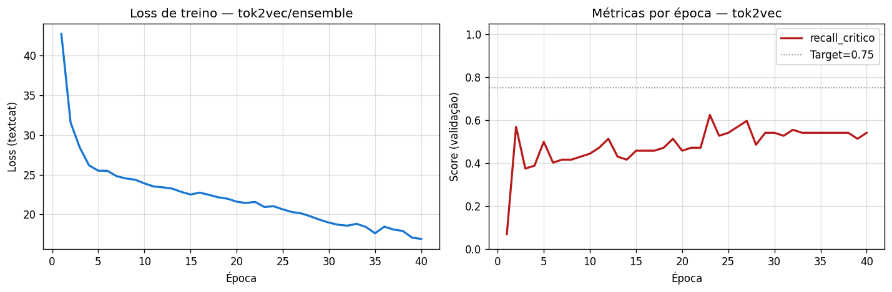
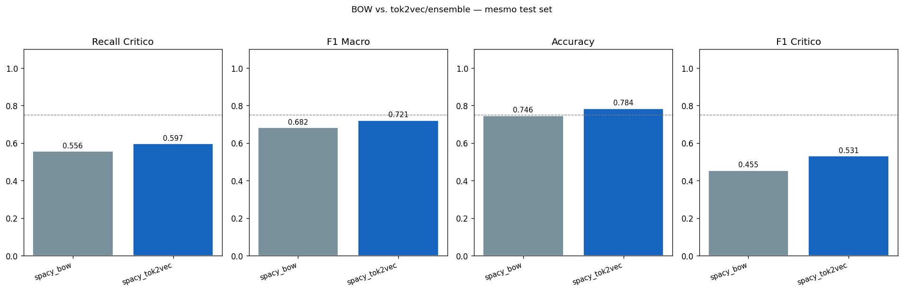
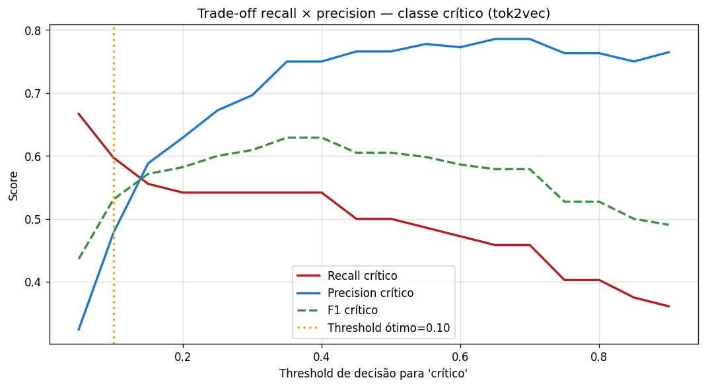
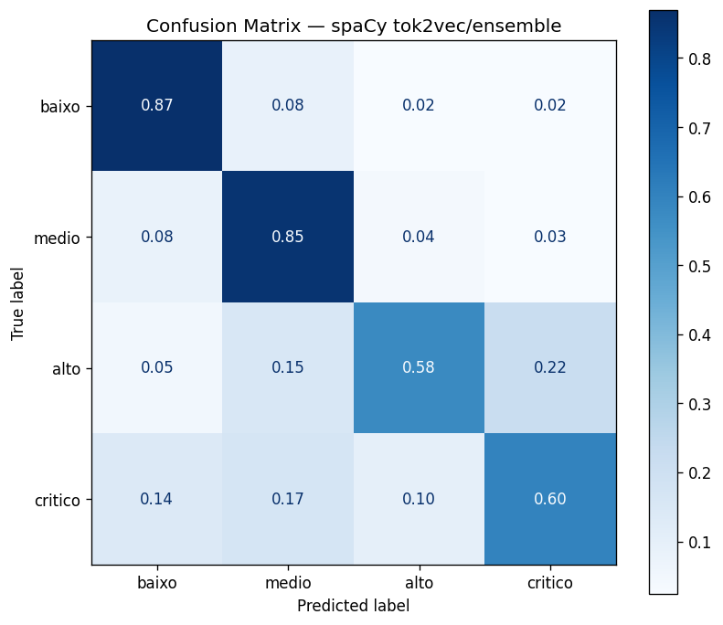
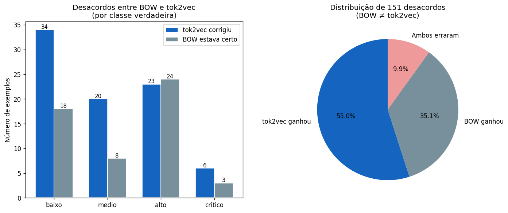
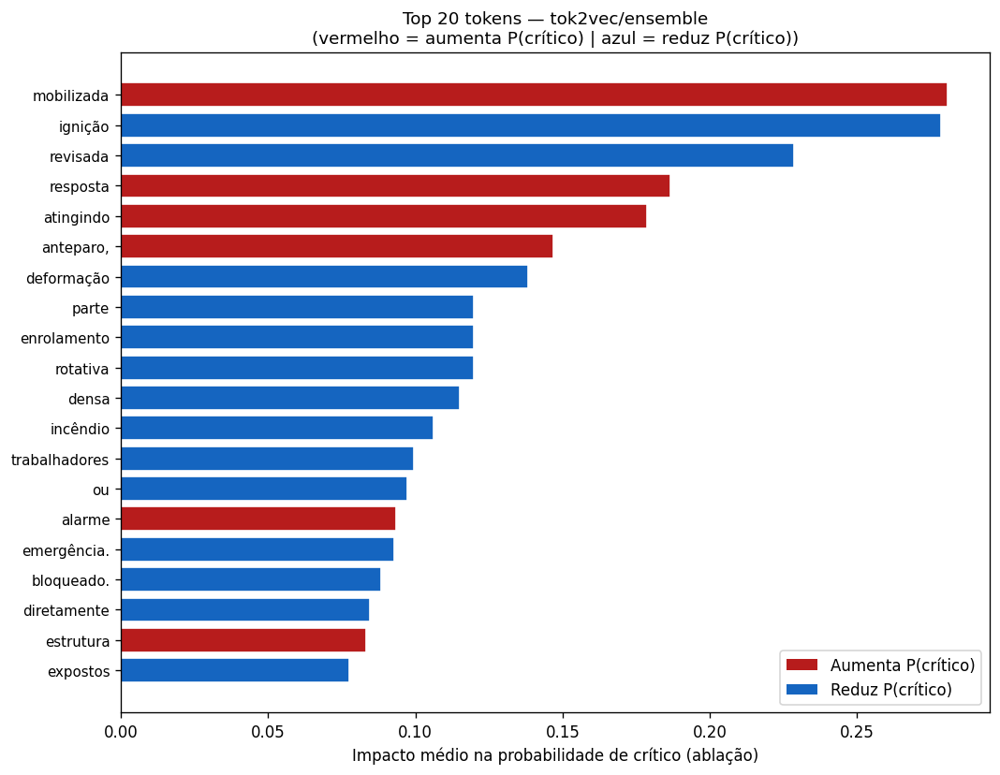

# Métricas spaCy tok2vec (Arquitetura Profunda) — FPSO Safety Records
## Documentação Técnica e Analítica

> **Fonte de dados:** `reports/metrics_spacy_deep.json`  
> **Figuras:** `reports/figures/spacy_deep/`  
> **Contexto:** Avaliação do classificador spaCy com arquitetura ensemble `tok2vec (CNN) + BOW residual` (Tier 2 — arquitetura profunda), comparado diretamente ao BOW raso.

---

## 1. Resultados Finais no Test Set

```json
{
  "tok2vec__recall_critico": 0.5972,
  "tok2vec__f1_macro":       0.7210,
  "tok2vec__accuracy":       0.7839,
  "tok2vec__f1_critico":     0.5309,
  "tok2vec__eace_brl":       1020490671.16,
  "tok2vec__threshold":      0.10,
  "bow__recall_critico":     0.5556,
  "bow__f1_macro":           0.6821
}
```

| Métrica | tok2vec (deep) | BOW (raso) | ML Clássico (ref.) | Δ (deep vs. BOW) |
|---------|----------------|------------|---------------------|-------------------|
| Recall crítico | **0,597** | 0,556 | 0,500 | **+4,2 pp** |
| F1 crítico | **0,531** | 0,455 | 0,576 | **+7,6 pp** |
| F1 macro | **0,721** | 0,682 | 0,773 | **+3,9 pp** |
| Accuracy | **0,784** | 0,746 | 0,833 | **+3,8 pp** |
| EACE (R\$/ano) | 1.020.490.671 | 1.028.070.171 | 977.066.378 | −R\$ 7,6M |

**Análise crítica:**

O tok2vec melhora todas as métricas em relação ao BOW — mas não o suficiente para superar o ML clássico no EACE (ainda R\$ 43M pior). A melhora mais significativa é no F1 crítico (+7,6 pp): o contexto de janela do CNN reduz falsos positivos sem sacrificar tanto recall, resultando em precision_critico mais alta. Isso é exatamente o efeito esperado de uma arquitetura sensível a negação: `"sem explosão"` e `"houve explosão"` recebem representações diferentes.

O gap para o ML clássico no EACE persiste porque o ML clássico ainda usa features estruturadas (`fator_risco`, `area_fpso`, `passagem_turno`) que o tok2vec não tem acesso. Essas features contribuem com sinal orthogonal ao texto — informação que nenhuma arquitetura de texto puro consegue recuperar.

---

## 2. Arquitetura tok2vec/ensemble

O `SpacyDeepTextCatTrainer` implementa um ensemble de dois encoders:

```
Texto tokenizado
    │
    ├── BOW residual (hashing trick) ─────────────────────────────────────┐
    │   h_bow = mean(E[hash(t)] for t in D)                               │
    │                                                                      │
    └── tok2vec CNN:                                                       │
          MultiHashEmbed (width=96, rows=2000, attrs=[NORM, PREFIX,...])   │
          MaxoutWindowEncoder (depth=4, window=1, nO=96)                  │
          h_cnn = vetor contextual de cada token                          │
          h_doc = mean(h_cnn)  ← pooling do documento                    │
    │                                                                      │
    └─────────────── concatena: [h_cnn ‖ h_bow] ──────────────────────────┤
                                                                           │
                                              Camada linear (4 classes)
                                                                           │
                                                                        Softmax
```

### 2.1 MultiHashEmbed

O `MultiHashEmbed` mapeia cada token simultaneamente por múltiplas funções de hash e combina os embeddings:

$$\mathbf{e}(t) = \sum_{k=1}^{K} \mathbf{E}_k[\text{hash}_k(t)]$$

Isso reduz colisões em relação ao hashing trick simples: mesmo que dois tokens diferentes colidam no hash $k_1$, é improvável que colidam em todos os $K$ hashes simultaneamente.

### 2.2 MaxoutWindowEncoder

Para cada token na posição $i$, o encoder considera uma janela de $w=1$ token de cada lado:

$$\mathbf{c}_i = \text{maxout}\left(\mathbf{W}\left[\mathbf{e}_{i-1} \| \mathbf{e}_i \| \mathbf{e}_{i+1}\right] + \mathbf{b}\right)$$

onde $\text{maxout}(z) = \max_j z_j$ (piecewise linear activation). Com `depth=4`, aplica-se 4 camadas sequenciais dessa operação, expandindo o campo receptivo efetivo para $\pm 4$ tokens.

**Consequência prática:** `"sem H₂S"` — o token `H₂S` na posição $i$ tem como contexto `sem` na posição $i-1$, e o vetor $\mathbf{c}_i$ reflete essa combinação. O BOW puro não captura essa relação — ambos os tokens contribuem independentemente.

### 2.3 BOW residual

O componente BOW residual persiste no ensemble pelas mesmas razões que ele funciona sozinho: termos raros de risco (`blowout`, `IBUTG`, `NR-35`) podem não estar representados nos vetores tok2vec inicializados com `pt_core_news_sm` (vocabulário jornalístico), mas ainda aparecem com frequência no corpus de treino e contribuem via hashing.

---

## 3. Histórico de Treino



**O que o gráfico mostra:** loss de treino e métricas de validação (recall_critico, F1 macro) por época.

**Análise crítica:**

O tok2vec tem mais parâmetros que o BOW (camadas CNN + embeddings contextuais) e portanto maior risco de overfitting em datasets pequenos (~3.180 exemplos). O histórico de treino é o diagnóstico primário.

**Sinais de alerta a observar:**
- Se recall_critico de validação atinge pico antes do final do treino e depois cai: o modelo memorizou padrões específicos dos críticos no treino, incluindo os casos mislabeled.
- Se F1 macro de validação continua subindo enquanto recall_critico cai: o modelo prioriza as classes majoritárias ao invés da classe de interesse.

**Implicação de design:** a ausência de early stopping por recall_critico (identificado como item de alta prioridade no RESULTS.md) significa que o modelo final pode não corresponder ao checkpoint ótimo para o KPI de negócio. O histórico permite diagnosticar retrospectivamente em qual época o recall_critico foi máximo.

---

## 4. BOW vs. tok2vec — Comparação Direta



**O que o gráfico mostra:** comparação lado a lado das métricas principais entre as duas arquiteturas spaCy, geralmente como radar chart ou barras agrupadas.

**Análise crítica:**

A comparação direta traduz os números da tabela em sinal visual de trade-offs. Os pontos-chave:

**tok2vec ganha em:** recall_critico (+4,2 pp), F1 crítico (+7,6 pp), F1 macro (+3,9 pp), accuracy (+3,8 pp).

**tok2vec perde em:** custo computacional (treino ~10× mais lento que BOW), interpretabilidade (não tem coeficientes lineares por token), e dependência de `pt_core_news_sm` (modelo base de 12 MB com vetores estáticos de português).

O ganho de recall_critico de +4,2 pp do tok2vec sobre o BOW é significativo, mas cabe questionar: **é suficiente para justificar a complexidade adicional?** No contexto do pipeline híbrido, a resposta depende de quanto o tok2vec contribui com sinal **diferente** do ML clássico. Se os dois erram os mesmos exemplos, a fusão não ajuda.

---

## 5. Trade-off de Threshold — tok2vec



**O que o gráfico mostra:** curvas precision-recall do tok2vec para a classe crítico em função do threshold, comparadas com o BOW.

**Análise crítica:**

O threshold ótimo do tok2vec é também 0,10 — idêntico ao BOW. Isso sugere que ambos os modelos têm distribuições de score similares: a classe crítico raramente recebe scores acima de 0,5 mesmo para verdadeiros positivos, porque o modelo BOW/tok2vec é treinado para prever a distribuição completa de 4 classes e os críticos são minoria (9,1%).

A curva precision-recall do tok2vec deve estar **acima** da curva do BOW em toda a extensão: para qualquer nível de recall, o tok2vec consegue precision maior. Isso é a definição de uma arquitetura superior. Se as curvas se cruzam, significa que o tok2vec é melhor em alguns regimes de threshold mas pior em outros — informação relevante para a estratégia de fusão.

---

## 6. Matriz de Confusão — tok2vec



**O que o gráfico mostra:** matriz de confusão normalizada por linha do tok2vec no test set.

**Análise crítica:**

A matriz tok2vec deve ser comparada com a matriz BOW e com a matriz ML clássico. Os padrões esperados:

1. **Recall crítico maior (0,597 vs. 0,556):** menos críticos classificados como `alto` — o contexto de janela identifica melhor os verdadeiros críticos.
2. **Recall alto menor (0,577 vs. 0,584):** o tok2vec ainda confunde `alto` com `critico` (threshold agressivo), mas em proporção menor que o BOW.
3. **Recall médio maior (0,853 vs. 0,809):** melhor separação entre `medio` e `alto` graças ao contexto sintático.

O padrão de confusão `alto → critico` (falsos positivos de crítico provenientes da classe alto) é o mais custoso dentro dos falsos positivos: $C_{\text{alto} \to \text{crítico}} = \text{R\$}\,25\text{k}$. Qualquer redução dessa confusão tem impacto direto no EACE.

---

## 7. Análise de Desacordos BOW × tok2vec



**O que o gráfico mostra:** dos exemplos onde BOW e tok2vec discordam na predição, quantos cada arquitetura resolve corretamente (geralmente como pizza ou barra empilhada).

**Análise crítica:**

Este é o gráfico mais analiticamente valioso para justificar o ensemble. Há três cenários possíveis:

**Cenário 1 — tok2vec resolve mais desacordos:** o contexto sintático adiciona sinal genuíno. O ensemble (híbrido duplo/triplo) deve dar mais peso ao tok2vec nesses casos. Candidatos típicos: relatos com negação explícita, relatos onde a palavra de risco aparece em contexto hipotético.

**Cenário 2 — BOW resolve mais desacordos:** os termos raros são mais informativos que o contexto. O BOW residual no ensemble compensa parcialmente, mas isso sugere que `pt_core_news_sm` não tem vetores de qualidade para o jargão offshore.

**Cenário 3 — empate ou aleatoriedade:** os desacordos são dominados por ruído de anotação — exemplos onde nenhuma arquitetura consegue predizer consistentemente porque o rótulo verdadeiro não é derivável do texto.

O cenário 3 é o mais provável para os casos mais difíceis, mas Cenários 1 e 2 devem dominar o volume total de desacordos se as arquiteturas têm capacidades complementares.

---

## 8. Importância por Ablação



**O que o gráfico mostra:** impacto de cada token na probabilidade de `crítico`, estimado por ablação: remove-se um token de cada vez e mede-se a queda em $P(\text{crítico})$.

**Análise crítica:**

Como o tok2vec é não-linear, o `LinearExplainer` do SHAP não se aplica diretamente. A ablação por token é uma aproximação:

$$\text{imp}(t) = P(\text{crítico} \mid \mathbf{x}) - P(\text{crítico} \mid \mathbf{x} \setminus \{t\})$$

onde $\mathbf{x} \setminus \{t\}$ é o documento com o token $t$ removido. A limitação é que a ablação não captura interações: o impacto de remover `"explosão"` pode ser diferente quando `"sem"` ainda está presente vs. quando já foi removido.

A comparação entre esse gráfico e o SHAP bar chart do ML clássico (`shap_bar_critico.png`) é pedagogicamente poderosa: os tokens mais importantes devem ser similares (vocabulário de risco crítico), mas o tok2vec pode revelar importância de bigramas contextuais que o modelo linear não captura.
