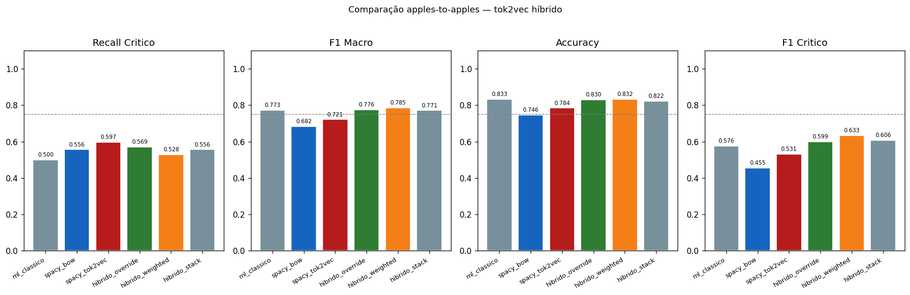
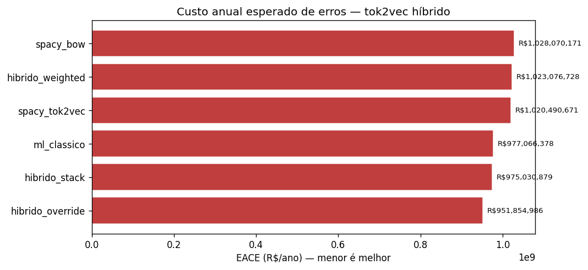
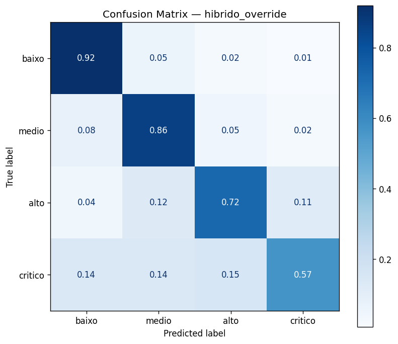
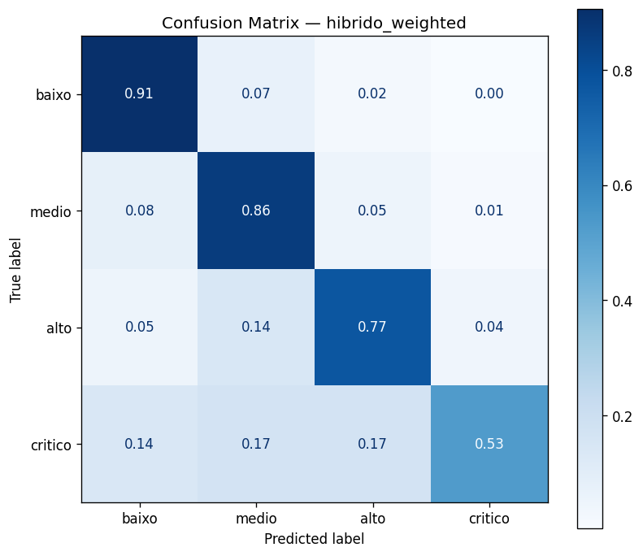
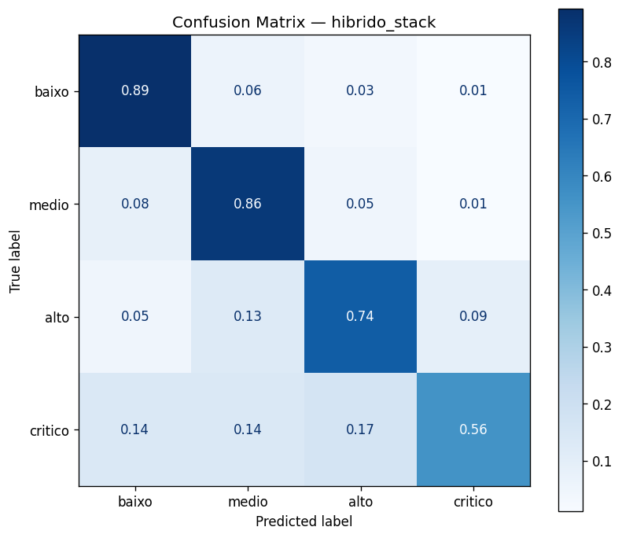

# Métricas — Híbrido Duplo Deep (ML + spaCy tok2vec)
## Documentação Técnica e Analítica

> **Fonte de dados:** `reports/metrics_hybrid_deep.json`  
> **Figuras:** `reports/figures/hybrid_deep/`  
> **Contexto:** Mesmas três estratégias de fusão do Híbrido Duplo, mas com **spaCy tok2vec** no lugar do spaCy BOW. Permite isolar o impacto da arquitetura spaCy (BOW vs. tok2vec) mantendo o ML clássico e as estratégias de fusão constantes.

---

## 1. Diferença em Relação ao Híbrido Duplo (BOW)

O Híbrido Deep substitui $\mathbf{s}^{\text{BOW}}$ por $\mathbf{s}^{\text{tok2vec}}$ em todas as três estratégias:

| Componente | Híbrido Duplo (BOW) | Híbrido Duplo Deep |
|------------|---------------------|---------------------|
| Modelo base 1 | LogReg + TF-IDF | LogReg + TF-IDF (idêntico) |
| Modelo base 2 | spaCy TextCatBOW | spaCy tok2vec/ensemble |
| Override threshold | $s^{\text{BOW}}_{\text{crítico}} \geq 0{,}40$ | $s^{\text{tok2vec}}_{\text{crítico}} \geq 0{,}40$ |
| Weighted | $0{,}4 \cdot p^{\text{ML}} + 0{,}6 \cdot s^{\text{BOW}}$ | $0{,}4 \cdot p^{\text{ML}} + 0{,}6 \cdot s^{\text{tok2vec}}$ |
| Stack features | $[p^{\text{ML}} \| s^{\text{BOW}}]$ (8 features) | $[p^{\text{ML}} \| s^{\text{tok2vec}}]$ (8 features) |

A comparação entre os dois híbridos duplos é um experimento controlado: tudo igual exceto a arquitetura spaCy.

---

## 2. Resultados Comparativos

### 2.1 Override Deep vs. Override (BOW)

| Modelo | Recall crítico | Precision crítico | F1 crítico | F1 macro | EACE (R\$/ano) |
|--------|----------------|-------------------|------------|----------|----------------|
| hibrido_override (BOW) | 0,528 | 0,514 | 0,521 | 0,750 | 976.595.921 |
| **hibrido_override (Deep)** | **0,569** | **0,631** | **0,599** | **0,776** | **951.854.986** |
| Δ | **+4,2 pp** | **+11,7 pp** | **+7,8 pp** | **+2,6 pp** | **−R\$ 24,7M** |

**Análise crítica:** a substituição do BOW pelo tok2vec no override produz os maiores ganhos de qualquer comparação par a par no projeto. O ganho simultâneo de recall (+4,2 pp) e precision (+11,7 pp) é incomum — normalmente um cresce à custa do outro. A explicação é que o tok2vec, com sua sensibilidade a contexto, ativa o override (score ≥ 0,40) em **casos mais certos**: a negação e o contexto reduzem falsos positivos (precision sobe) enquanto o melhor recall do tok2vec base reduz falsos negativos (recall sobe). O EACE de R\$ 951,9M é o melhor EACE de qualquer sistema duplo no projeto.

### 2.2 Weighted Deep vs. Weighted (BOW)

| Modelo | Recall crítico | Precision crítico | F1 crítico | F1 macro | EACE (R\$/ano) |
|--------|----------------|-------------------|------------|----------|----------------|
| hibrido_weighted (BOW) | 0,417 | 0,588 | 0,488 | 0,724 | 1.094.616.974 |
| **hibrido_weighted (Deep)** | **0,528** | **0,792** | **0,633** | **0,785** | **1.023.076.728** |
| Δ | **+11,1 pp** | **+20,4 pp** | **+14,5 pp** | **+6,1 pp** | **−R\$ 71,5M** |

**Análise crítica:** a versão Deep resolve o problema de calibração que afundou o Weighted (BOW). O tok2vec produz scores melhor calibrados do que o BOW: os scores $s^{\text{tok2vec}}_{\text{crítico}}$ têm distribuição mais próxima das probabilidades $p^{\text{ML}}_{\text{crítico}}$, tornando a combinação linear mais coerente. O ganho de +11,1 pp em recall é o maior salto individual de toda a comparação. Precision crítico de 0,792 é o mais alto entre todos os sistemas não-ML-puro — o modelo Deep Weighted tem ótima precisão mas ainda recall inferior ao override.

### 2.3 Stack Deep vs. Stack (BOW)

| Modelo | Recall crítico | Precision crítico | F1 crítico | F1 macro | EACE (R\$/ano) |
|--------|----------------|-------------------|------------|----------|----------------|
| hibrido_stack (BOW) | 0,514 | 0,578 | 0,544 | 0,728 | 983.200.818 |
| **hibrido_stack (Deep)** | **0,556** | **0,667** | **0,606** | **0,771** | **975.030.879** |
| Δ | **+4,2 pp** | **+8,9 pp** | **+6,2 pp** | **+4,3 pp** | **−R\$ 8,2M** |

**Análise crítica:** o Stack Deep tem EACE de R\$ 975M — notavelmente próximo do ML puro (R\$ 977M) e do override (BOW) (R\$ 977M). A melhoria do meta-modelo quando usa tok2vec em vez de BOW confirma que features de entrada de melhor qualidade beneficiam o stacking: o meta-modelo recebe 8 features mais informativas e aprende pesos mais acertados.

---

## 3. Quadro Completo — Todos os Sistemas Duplos

| Modelo | Recall crítico | F1 macro | EACE (R\$/ano) | Vencedor? |
|--------|----------------|----------|----------------|-----------|
| ml_classico | 0,500 | 0,773 | 977.066.378 | ref. |
| spacy_bow | 0,556 | 0,682 | 1.028.070.171 | — |
| spacy_tok2vec | **0,597** | 0,721 | 1.020.490.671 | recall |
| hibrido_override (BOW) | 0,528 | 0,750 | 976.595.921 | — |
| hibrido_weighted (BOW) | 0,417 | 0,724 | 1.094.616.974 | pior |
| hibrido_stack (BOW) | 0,514 | 0,728 | 983.200.818 | — |
| **hibrido_override (Deep)** | 0,569 | 0,776 | **951.854.986** | **EACE** |
| hibrido_weighted (Deep) | 0,528 | **0,785** | 1.023.076.728 | — |
| hibrido_stack (Deep) | 0,556 | 0,771 | 975.030.879 | — |

O `hibrido_override (Deep)` é o vencedor por EACE entre todos os sistemas duplos — R\$ 25M melhor que o ML puro. O `spacy_tok2vec` puro ainda lidera em recall_critico, mas ao custo de EACE R\$ 43M pior que o override Deep.

---

## 4. Figuras

### 4.1 Comparação de Modelos

**Análise crítica:** o gráfico deve mostrar que o override Deep (tok2vec) domina o override BOW em todas as métricas simultaneamente — uma das poucas situações no projeto onde não há trade-off. Isso justifica o investimento em arquitetura mais profunda para o componente spaCy do híbrido.

### 4.2 EACE — Custo Anual Esperado

**Análise crítica:** o override Deep com R\$ 951,9M é o menor EACE já obtido nesta família de experimentos. A visualização deve destacar que o ganho sobre o ML puro (−R\$ 25,2M/ano) é real, porém modesto em termos relativos (~2,6%). Para uma operação FPSO de grande porte, R\$ 25M/ano é significativo — mas a incerteza do dataset sintético provavelmente é maior que essa margem.

### 4.3 Matrizes de Confusão

**Análise crítica (comparação entre matrizes):**

A inclusão das matrizes do ML clássico, BOW e tok2vec ao lado dos híbridos permite rastrear como cada estratégia de fusão modifica o padrão de erros. Os pontos-chave:

1. **Override Deep reduz `crítico→alto` e `crítico→medio`** em relação ao ML puro: os critérios adicionais capturados pelo tok2vec (contexto sintático, bigramas de risco) identificam críticos que o TF-IDF classificava como alto.

2. **Weighted Deep melhora `crítico→baixo` drasticamente**: precision_critico de 0,792 significa que a célula `alto→crítico` e `medio→crítico` (falsos positivos) são menores. A explicação é que o tok2vec calibrado, quando combinado com o ML, raramente eleva a score total de crítico para não-críticos.

3. **Stack Deep como benchmark:** com EACE de R\$ 975M e recall_critico de 0,556, o Stack Deep produz o melhor equilíbrio entre as duas dimensões — quase igual ao ML puro em EACE, mas com mais críticos identificados.

---

## 5. Por que o Weighted Melhora Tanto com tok2vec?

A melhora de +11,1 pp em recall e −R\$ 71,5M em EACE do Weighted ao trocar BOW por tok2vec merece análise dedicada.

O problema do Weighted (BOW) foi identificado como descalibração de scores. O tok2vec melhora isso por dois motivos:

**1. Distribuição de scores mais uniforme:** o tok2vec ensemble (CNN + BOW residual) produz scores de probabilidade com melhor cobertura do intervalo [0,1]. O BOW puro tende a ter scores bimodais (próximos de 0 ou 1), enquanto o tok2vec tem distribuição mais contínua — mais próxima de uma probabilidade real.

**2. Representação mais rica:** o tok2vec diferencia `"pressão elevada"` de `"sem pressão elevada"`, reduzindo o score de crítico para o segundo caso. Isso move os falsos positivos de crítico do BOW para suas classes corretas, liberando o Weighted para usar um threshold efetivo mais alto sem sacrificar recall dos verdadeiros críticos.

A fórmula do Weighted permanece idêntica:

$$\hat{y} = \arg\max_k \left( 0{,}4 \cdot p^{\text{ML}}_k + 0{,}6 \cdot s^{\text{tok2vec}}_k \right)$$

Mas com $s^{\text{tok2vec}}$ melhor calibrado, a combinação linear passa a funcionar como esperado.
