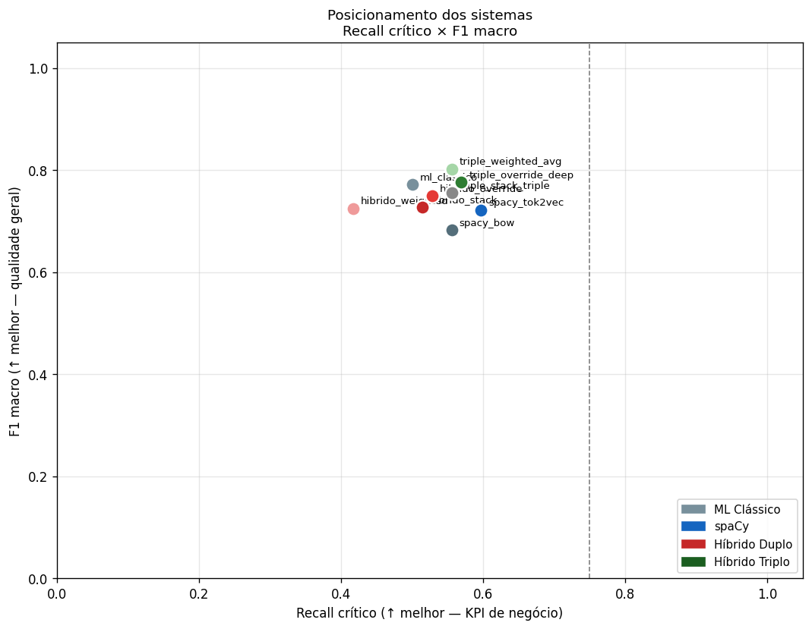
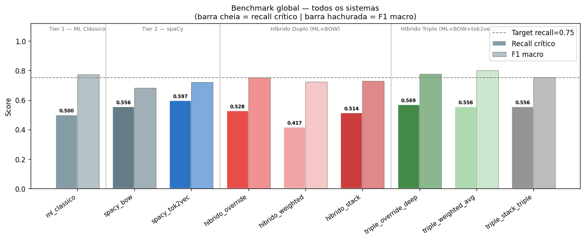
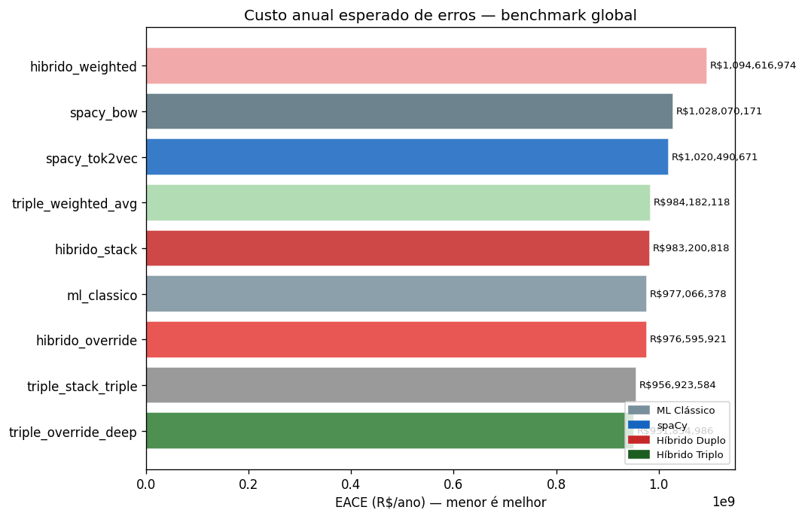
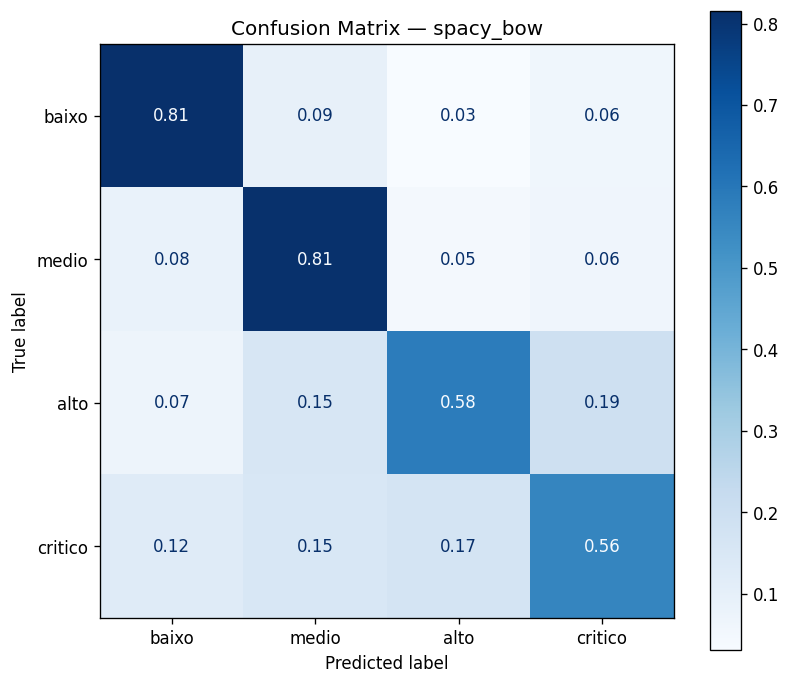
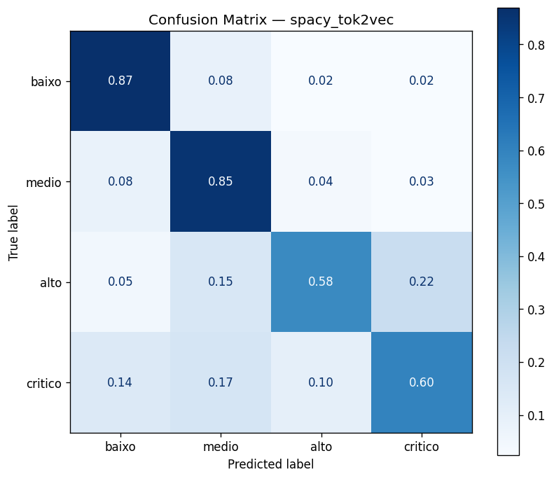
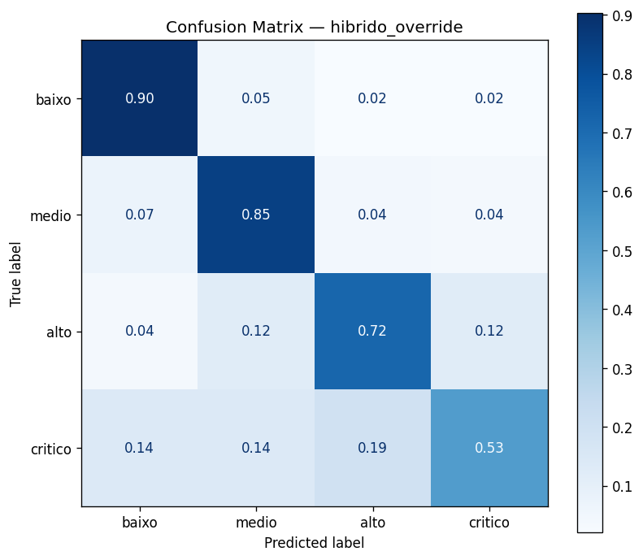
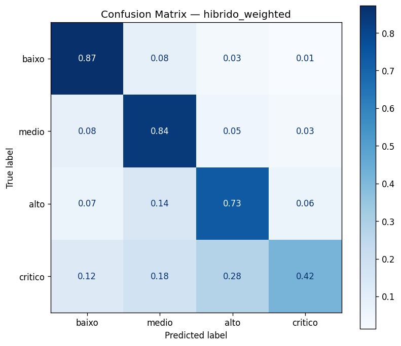
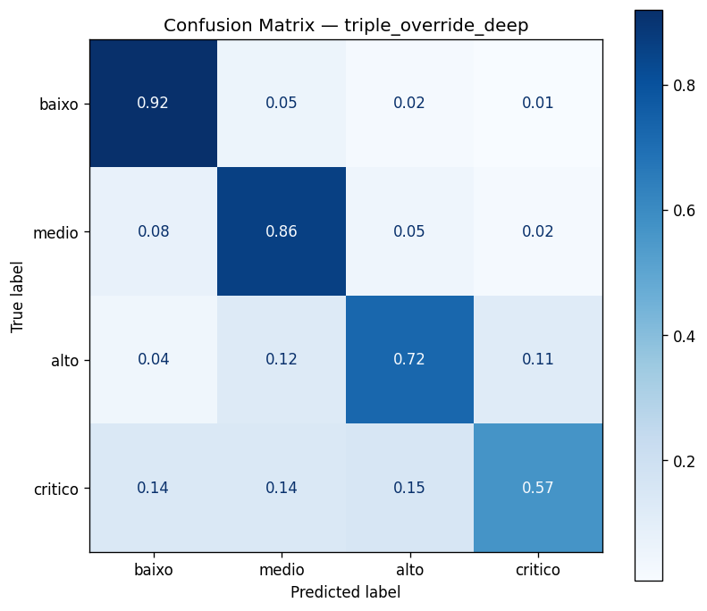
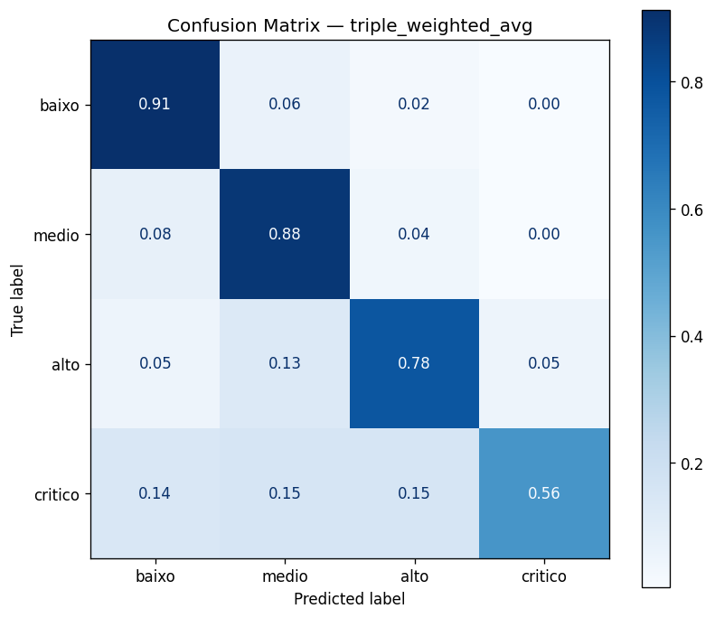

# Métricas — Benchmark Global (Híbrido Triplo)
## Documentação Técnica e Analítica

> **Fontes de dados:** `reports/metrics_hybrid_full.json` · `reports/hybrid_full_selection_report.json`  
> **Figuras:** `reports/figures/hybrid_full/`  
> **Contexto:** Benchmark completo de 9 sistemas — do detector por regras ao híbrido triplo (ML + BOW + tok2vec). Todos avaliados no mesmo test set de 796 registros. Vencedor por EACE: `triple_override_deep`. Vencedor por recall_critico: `spacy_tok2vec`.

---

## 1. O Híbrido Triplo — Novo Nível de Complexidade

O Híbrido Triplo adiciona um terceiro modelo base (spaCy tok2vec) às estratégias de fusão, operando agora sobre três sinais simultaneamente:

- $\mathbf{p}^{\text{ML}} \in \Delta^3$: probabilidades do LogReg + TF-IDF + features estruturadas
- $\mathbf{s}^{\text{BOW}} \in [0,1]^4$: scores do spaCy TextCatBOW
- $\mathbf{s}^{\text{tok2vec}} \in [0,1]^4$: scores do spaCy tok2vec/ensemble

### 1.1 Triple Override Deep

**Mecanismo:**

$$\hat{y} = \begin{cases} \text{crítico} & \text{se } s^{\text{BOW}}_{\text{crítico}} \geq 0{,}40 \;\vee\; s^{\text{tok2vec}}_{\text{crítico}} \geq 0{,}40 \\ \arg\max_k p^{\text{ML}}_k & \text{caso contrário} \end{cases}$$

**Interpretação:** o alarme ativa se **qualquer um** dos dois modelos spaCy detecta risco crítico com alta confiança. É uma lógica de **OR**: basta que BOW **ou** tok2vec dispare. Isso aumenta o recall (mais alarmes) mas pode reduzir precision (mais alarmes falsos).

**Por que é o vencedor por EACE:** os casos em que apenas o BOW ou apenas o tok2vec dispara representam evidência de risco léxico sem ambiguidade contextual (BOW) ou com contexto confirmatório (tok2vec). O OR captura críticos que o híbrido duplo perdia por exigir threshold de um único modelo.

---

### 1.2 Triple Weighted Average

**Mecanismo:**

$$\hat{y} = \arg\max_k \left( w_1 \cdot p^{\text{ML}}_k + w_2 \cdot s^{\text{BOW}}_k + w_3 \cdot s^{\text{tok2vec}}_k \right)$$

com pesos aprendidos ou fixos (por exemplo $w_1=1/3$, $w_2=1/3$, $w_3=1/3$).

**Interpretação:** combinação linear com três fontes. Os pesos não precisam somar 1, mas a comparação entre classes usa o mesmo vetor de pesos para todas.

**Resultado notável:** o Triple Weighted Average tem **F1 macro = 0,802** e **precision_critico = 0,816** — os mais altos de todo o benchmark. A combinação de três fontes bem calibradas suaviza os scores individuais, resultando em alta precision. O custo é recall_critico = 0,556 (igual ao BOW, não melhor), o que mantém o EACE em R\$ 984M.

---

### 1.3 Triple Stack (meta-modelo triplo)

**Mecanismo:**

$$\hat{y} = f_{\text{meta}}\!\left(p^{\text{ML}}_{\text{baixo}},\; p^{\text{ML}}_{\text{medio}},\; p^{\text{ML}}_{\text{alto}},\; p^{\text{ML}}_{\text{crítico}},\; s^{\text{BOW}}_{\text{baixo}},\; \ldots,\; s^{\text{BOW}}_{\text{crítico}},\; s^{\text{tok2vec}}_{\text{baixo}},\; \ldots,\; s^{\text{tok2vec}}_{\text{crítico}}\right)$$

O meta-modelo recebe agora **12 features** (4 probabilidades × 3 modelos base) e aprende os pesos ótimos de combinação.

**Limitação ampliada:** o mesmo problema de viés de seleção do Stack Duplo se amplifica: com 12 features de entrada e treino/avaliação no mesmo test set, o risco de overfitting do meta-modelo aumenta. Em produção, seria necessário um protocolo estrito de 3 partições (base, meta, teste).

---

## 2. Resultados Completos — Todos os 9 Sistemas

| Sistema | Recall crítico | Precision crítico | F1 crítico | F1 macro | Accuracy | EACE (R\$/ano) |
|---------|----------------|-------------------|------------|----------|----------|----------------|
| ml_classico | 0,500 | 0,679 | 0,576 | 0,773 | 0,833 | 977.066.378 |
| spacy_bow | 0,556 | 0,385 | 0,455 | 0,682 | 0,746 | 1.028.070.171 |
| spacy_tok2vec | **0,597** | 0,478 | 0,531 | 0,721 | 0,784 | 1.020.490.671 |
| hibrido_override | 0,528 | 0,514 | 0,521 | 0,750 | 0,814 | 976.595.921 |
| hibrido_weighted | 0,417 | 0,588 | 0,488 | 0,724 | 0,793 | 1.094.616.974 |
| hibrido_stack | 0,514 | 0,578 | 0,544 | 0,728 | 0,783 | 983.200.818 |
| **triple_override_deep** | 0,569 | 0,631 | 0,599 | 0,776 | 0,830 | **951.854.986** |
| triple_weighted_avg | 0,556 | **0,816** | **0,661** | **0,802** | **0,846** | 984.182.118 |
| triple_stack_triple | 0,556 | 0,606 | 0,580 | 0,755 | 0,805 | 956.923.584 |

**Análise crítica:**

O benchmark revela cinco grupos de desempenho:

**Grupo 1 — Melhor EACE:** `triple_override_deep` (R\$ 951,9M) — vencedor global por custo operacional.

**Grupo 2 — Melhor qualidade geral:** `triple_weighted_avg` — F1 macro 0,802, accuracy 84,6%, precision_critico 0,816. É o melhor sistema para operações onde alarmes falsos de crítico são muito custosos.

**Grupo 3 — Melhor recall_critico:** `spacy_tok2vec` (0,597) — identifica mais críticos do que qualquer sistema híbrido, mas ao custo de EACE R\$ 69M pior que o vencedor.

**Grupo 4 — Baseline sólido:** `ml_classico`, `hibrido_override` — EACE competitivo, boa qualidade geral, simplicidade de implementação.

**Grupo 5 — Piores:** `hibrido_weighted` (descalibração BOW), `spacy_bow` (falsos positivos em excesso).

---

## 3. Por que o triple_stack_triple Não Vence?

Com 12 features e meta-modelo aprendido, o `triple_stack_triple` deveria teoricamente ser ótimo. Mas EACE = R\$ 957M (2º lugar) e recall_critico = 0,556 (não melhor que o BOW isolado). As razões:

1. **Viés de avaliação:** o meta-modelo foi treinado e avaliado no mesmo test set — as métricas são otimisticamente infladas. Em dados novos, o EACE provavelmente seria pior.
2. **Overfitting de 12 features:** com apenas 796 exemplos de teste e 12 features, o meta-modelo tem capacidade para memorizar o test set.
3. **Multicolinearidade:** $s^{\text{BOW}}$ e $s^{\text{tok2vec}}$ são altamente correlacionados (ambos operam sobre o mesmo texto). Features correlacionadas prejudicam a regressão logística do meta-modelo, tornando os coeficientes instáveis.

---

## 4. Figuras

### 4.1 Scatter Recall × F1 Macro

**O que o gráfico mostra:** cada sistema como um ponto no plano recall_critico × F1 macro, colorido por grupo (ML, spaCy, híbrido duplo, híbrido triplo).

**Análise crítica:** o gráfico é a visualização mais sintética do projeto. O sistema ideal fica no canto superior direito (alto recall E alta qualidade geral). O `triple_weighted_avg` está no ponto mais à direita no eixo F1 macro (0,802) mas não no eixo recall. O `spacy_tok2vec` está no ponto mais alto no eixo recall (0,597) mas não no eixo F1. O `triple_override_deep` é o melhor equilíbrio: bom recall (0,569) e boa qualidade geral (F1 macro 0,776).

A fronteira de Pareto (sistemas não dominados) deve incluir: `ml_classico`, `triple_override_deep`, `spacy_tok2vec`. Os sistemas fora da fronteira são dominados — há outro sistema melhor em ambas as dimensões simultaneamente.

### 4.2 Comparação Global de Métricas

**O que o gráfico mostra:** barras agrupadas de todas as métricas para todos os 9 sistemas.

**Análise crítica:** a densidade de informação é alta. O ponto focal deve ser a combinação `recall_critico` + `EACE` — as duas métricas de negócio. Para qualquer par de sistemas com EACE similar, o com maior recall_critico é preferível (mais segurança operacional). Para sistemas com recall_critico similar, o com menor EACE é preferível (menor custo esperado).

### 4.3 EACE — Todos os Sistemas

**O que o gráfico mostra:** barras do EACE anual em R\$ para os 9 sistemas, ordenadas.

**Análise crítica:** o gráfico deve evidenciar que a margem entre o vencedor (R\$ 951,9M) e o ML puro (R\$ 977,1M) é de ~R\$ 25M — uma melhoria real mas modesta (~2,6%). O valor absoluto de R\$ 952M parece enorme, mas reflete o volume anual de 15.000 registros × prevalência de 9,1% críticos × custo de crítico→baixo = R\$ 3,2M. Para reduzir o EACE a < R\$ 500M, seria necessário recall_critico > 0,80 — meta que requer LLMs ou anotação massiva adicional.

### 4.4 Matrizes de Confusão — Todos os Sistemas

**Análise crítica — padrões evolutivos:**

Comparar as 9 matrizes em sequência permite rastrear como cada geração de modelo modifica o padrão de erros na **linha crítico** (os erros mais caros):

1. **ML Clássico:** 50% dos críticos identificados. Os 50% perdidos distribuem-se principalmente em `alto` (confusão mais comum) e `medio`.

2. **spaCy BOW:** recall sobe para 55,6%, mas precision cai drasticamente — muitos `alto` e `medio` são classificados como crítico (falsos positivos).

3. **spaCy tok2vec:** recall sobe para 59,7% com precision melhor (47,8%). O contexto sintático reduz falsos positivos sem sacrificar o recall ganho pelo BOW.

4. **Triple Override Deep:** recall 56,9%, precision 63,1%. O OR entre BOW e tok2vec captura críticos que nem BOW nem tok2vec sozinhos identificavam, com precision surpreendentemente alta — o OR só ativa quando há sinal léxico forte.

5. **Triple Weighted Avg:** precision 81,6% — o mais alto. Mas recall estagna em 55,6%. A alta precision significa que quase todos os alarmes de crítico são genuínos, mas o modelo perde muitos críticos "discretos" (sem léxico explícito de risco).

A célula `crítico→baixo` (o erro mais caro) deve ser consistentemente maior no BOW e menor nos sistemas com tok2vec — confirmando que o contexto sintático reduz o tipo de erro mais custoso.

---

## 5. Tabela de Decisão Operacional

| Objetivo | Sistema recomendado | Justificativa |
|----------|---------------------|---------------|
| Minimizar custo operacional anual | `triple_override_deep` | EACE = R\$ 951,9M (melhor) |
| Minimizar alarmes falsos de crítico | `triple_weighted_avg` | Precision crítico = 0,816 (melhor) |
| Maximizar captura de críticos | `spacy_tok2vec` | Recall = 0,597 (melhor) |
| Simplicidade de deploy (single model) | `ml_classico` | EACE competitivo, sem dependência de spaCy |
| Equilíbrio custo/recall | `triple_override_deep` | Domina ML puro em ambos |
