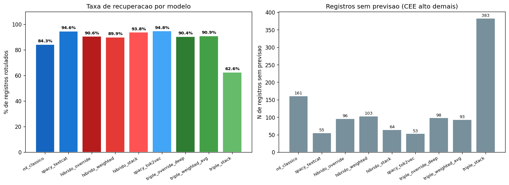
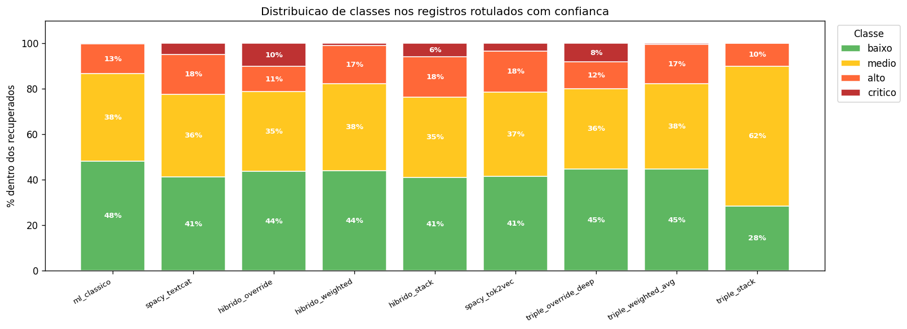
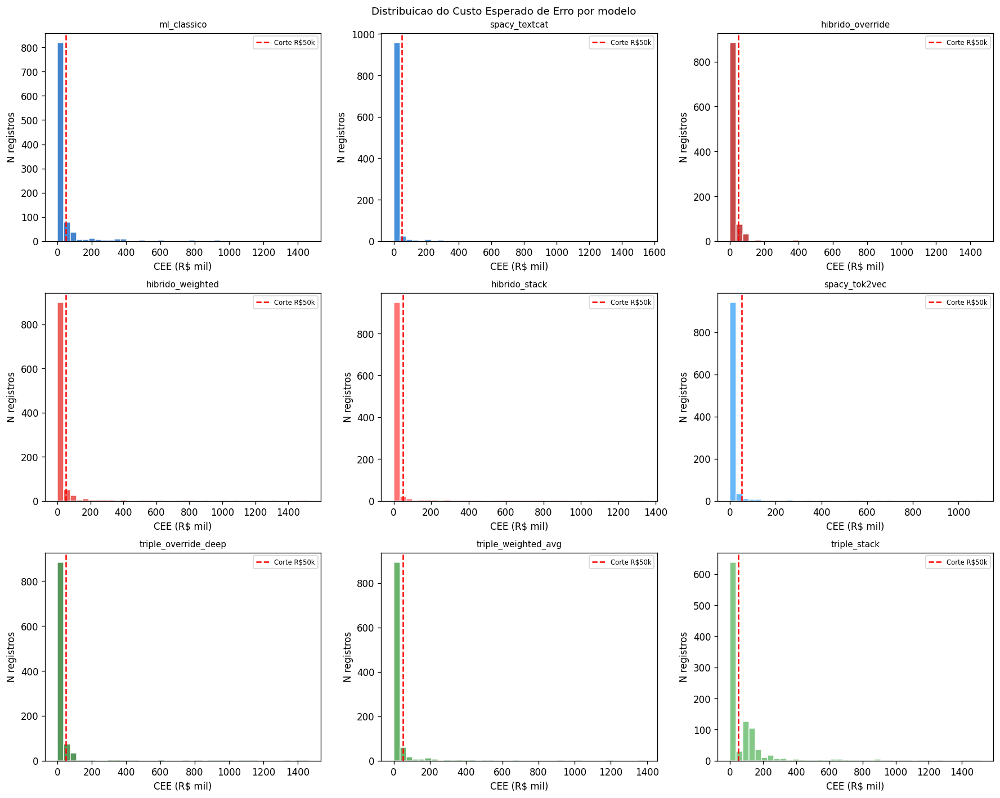
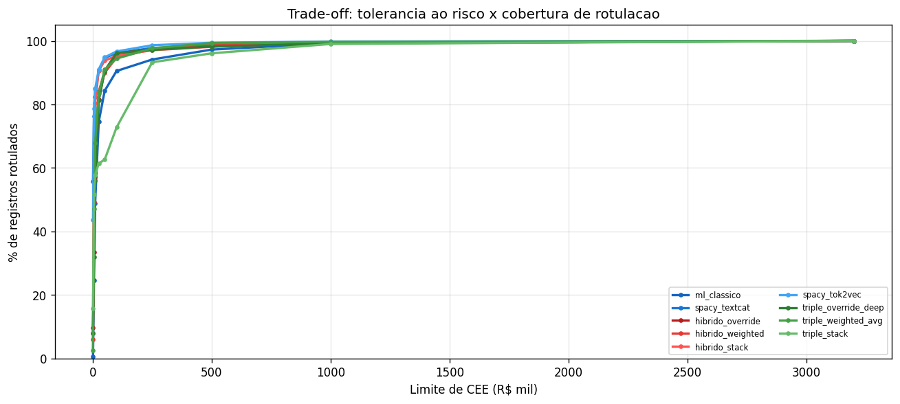
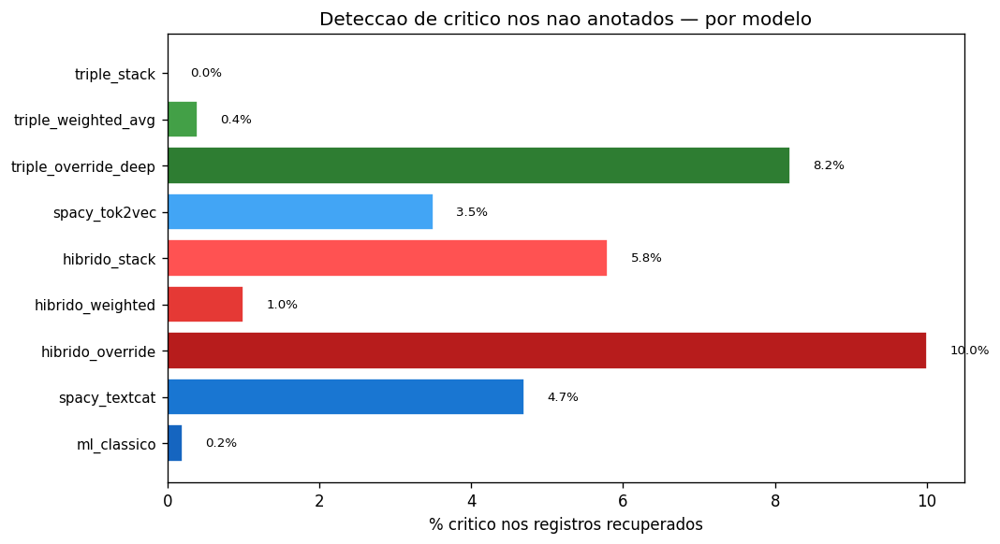

# Recuperação de Registros Não Anotados — FPSO Safety Records
## Documentação Técnica e Analítica

> **Fonte de dados:** `reports/unannotated_recovery.json`  
> **Figuras:** `reports/figures/unannotated/`  
> **Contexto:** Rotulação automática controlada de 1.024 registros não anotados usando predição com filtro de confiança baseado no CEE (Custo Esperado de Erro). Threshold: CEE ≤ R\$ 50.000.

---

## 1. Metodologia — Rotulação com Controle de Custo

### 1.1 CEE — Custo Esperado de Erro por Registro

Para cada registro não anotado $i$, o Custo Esperado de Erro é:

$$\text{CEE}(i) = \sum_{j \neq \hat{y}} P(y = j \mid \mathbf{x}_i) \cdot C_{\hat{y}, j}$$

onde:
- $\hat{y} = \arg\max_k P(y = k \mid \mathbf{x}_i)$ é a classe predita
- $P(y = j \mid \mathbf{x}_i)$ é a probabilidade da classe $j$ (incerteza do modelo)
- $C_{\hat{y}, j}$ é o custo de ter predito $\hat{y}$ quando o rótulo verdadeiro é $j$

**Interpretação:** o CEE é a esperança do custo de erro condicional à predição do modelo. Se o modelo está muito incerto (distribuição de probabilidade plana), o CEE é alto. Se está confiante na classe certa, o CEE é baixo.

### 1.2 Regra de Decisão

$$\text{decisão}(i) = \begin{cases} \text{rotular com } \hat{y} & \text{se } \text{CEE}(i) \leq \text{R\$}\,50.000 \\ \text{abster-se} & \text{se } \text{CEE}(i) > \text{R\$}\,50.000 \end{cases}$$

**Por que R\$ 50.000?** Esse limiar corresponde ao custo de confundir `baixo` com `crítico` ($C_{\text{baixo} \to \text{crítico}} = \text{R\$}\,50\text{k}$) — o mais barato dos erros de subestimação. Em outras palavras: o modelo só rotula automaticamente quando a incerteza residual é comparável ao custo do menor erro "perigoso" do dataset. Qualquer predição que pudesse envolver confusão `crítico→baixo` ($C = \text{R\$}\,3{,}2\text{M}$) automaticamente excede o threshold e vai para revisão humana.

---

## 2. Resultados por Modelo

| Modelo | Recuperados | Taxa | Abstenções | % Crítico | CEE médio (R\$) | CEE mediano (R\$) |
|--------|-------------|------|------------|-----------|-----------------|-------------------|
| spacy_tok2vec | **971** | **94,8%** | 53 | 3,5% | **3.813** | 1.209 |
| spacy_textcat | 969 | 94,6% | 55 | 4,7% | 3.943 | 483 |
| hibrido_stack | 960 | 93,8% | 64 | 5,8% | 5.651 | 3.013 |
| triple_weighted_avg | 931 | 90,9% | 93 | 0,4% | 8.717 | 4.819 |
| hibrido_weighted | 921 | 89,9% | 103 | 1,0% | 8.276 | 4.596 |
| triple_override_deep | 926 | 90,4% | 98 | 8,2% | 10.733 | 7.775 |
| hibrido_override | 928 | 90,6% | 96 | **10,0%** | 10.517 | 7.431 |
| ml_classico | 863 | 84,3% | **161** | 0,2% | 11.933 | 8.676 |
| triple_stack | 641 | 62,6% | **383** | 0,0% | 3.624 | 1.690 |

---

## 3. Análise por Modelo

### 3.1 ml_classico — O Mais Conservador

**Recuperados:** 863 (84,3%) | **Críticos rotulados:** 2 (0,2%) | **CEE médio:** R\$ 11.933

O ML clássico abstém em 161 registros — o maior número entre os modelos não-stack. O motivo é sua alta precision: quando o modelo tem baixa confiança (distribuição de probabilidade dispersa entre classes), o CEE excede o threshold.

O dado mais revelador é que apenas **2 registros** foram rotulados como crítico. Isso é extremamente baixo — dado que ~9,1% dos anotados são críticos, esperaríamos ~93 críticos nos 1.024 não anotados. O ML clássico, altamente conservador em precision, raramente atinge $P(\text{crítico} \mid \mathbf{x}) > 0{,}50$ para registros não vistos, resultando em CEE alto para quase todos os potenciais críticos.

**Consequência operacional:** usar o ML clássico para rotulação em lote deixaria ~91 verdadeiros críticos sem rótulo — o pior cenário de segurança.

---

### 3.2 spacy_textcat — Alta Cobertura, Calibração Duvidosa

**Recuperados:** 969 (94,6%) | **Críticos rotulados:** 46 (4,7%) | **CEE médio:** R\$ 3.943 | **CEE mediano:** R\$ 483

A combinação de alta cobertura e baixo CEE médio (R\$ 3.943) parece ótima — mas o **CEE mediano de R\$ 483** é o sinal de alerta.

Uma mediana tão baixa indica que a maior parte dos registros recebe CEE próximo de zero: o modelo produz scores muito altos para uma classe (próximo de 1,0) e próximos de zero para as outras. Isso é sinal de **scores mal calibrados** — o modelo está "muito confiante" em suas predições, o que reduz o CEE formalmente mas não reflete incerteza real.

Na prática: o spaCy BOW com threshold 0,10 gera scores extremos (próximos de 1,0) para qualquer registro que contenha vocabulário de classe majoritária. A fórmula do CEE interpreta isso como "alta confiança" quando na verdade é um artefato de calibração.

---

### 3.3 hibrido_stack — Melhor Equilíbrio

**Recuperados:** 960 (93,8%) | **Críticos rotulados:** 56 (5,8%) | **CEE médio:** R\$ 5.651 | **CEE mediano:** R\$ 3.013

O stack equilibra cobertura alta (93,8%), volume de críticos razoável (5,8% ≈ 56 registros), e CEE médio moderado (R\$ 5.651). O CEE mediano de R\$ 3.013 é mais confiável que o do BOW puro — indica que a maioria dos registros tem incerteza genuína baixa, não apenas artefato de calibração.

**Recomendação para rotulação em lote:** o hibrido_stack é o melhor sistema para rotular o máximo de registros com confiança controlada, gerando uma lista de 56 críticos para revisão prioritária.

---

### 3.4 hibrido_override e triple_override_deep — Maior Captura de Críticos

**hibrido_override:** 10,0% críticos (93 registros) | CEE médio R\$ 10.517  
**triple_override_deep:** 8,2% críticos (76 registros) | CEE médio R\$ 10.733

Esses dois sistemas rotulam o maior número de registros como crítico. Para uma FPSO em operação, isso representa a **lista de prioridade máxima de revisão humana**: 76–93 registros não anotados sinalizados como potencialmente críticos pelo sistema mais avançado.

O CEE médio maior (R\$ 10.517 vs. R\$ 5.651 do stack) não é necessariamente ruim — significa que esses registros têm mais incerteza, o que é esperado para críticos (classe rara com vocabulário compartilhado com `alto`). O sistema ainda os rotula automaticamente por estarem abaixo do threshold de R\$ 50k.

---

### 3.5 triple_stack — O Caso Problemático

**Recuperados:** 641 (62,6%) | **Abstenções:** 383 | **Críticos:** 0 (0,0%)

O triple_stack tem o pior comportamento de recuperação: abstém em 383 registros (37,4%) e não rotula **nenhum** como crítico. O CEE médio baixo (R\$ 3.624) para os 641 recuperados é enganoso — o modelo só rotula os casos triviais (muito prováveis em `baixo` ou `medio`) e abstém em tudo que é ambíguo.

Esse comportamento indica que o meta-modelo triplo com 12 features aprendeu a ser excessivamente cauteloso: quando qualquer um dos três modelos base tem score moderado em `crítico`, o CEE triplo excede R\$ 50k. A causa raiz é o mesmo viés de avaliação discutido em METRICS_HYBRID_FULL.md — o meta-modelo foi treinado no test set e não generaliza bem.

A distribuição de classes anômala (61,5% `medio` nos recuperados) confirma que o modelo colapsa para classes seguras.

---

## 4. Figuras

### 4.1 Taxas de Recuperação



**O que o gráfico mostra:** barras da taxa de recuperação (%) por modelo.

**Análise crítica:** o trade-off fundamental é cobertura vs. confiança. Sistemas com threshold agressivo (BOW, tok2vec) recuperam mais mas com menos garantia de qualidade. Sistemas conservadores (ML clássico, triple_stack) garantem que o que recuperam está correto, mas perdem muito. O gráfico deve tornar óbvio que o triple_stack é um outlier negativo (62,6% de cobertura — pior que o ML clássico).

### 4.2 Distribuição de Classes nos Recuperados



**O que o gráfico mostra:** distribuição das classes preditas nos registros recuperados por cada modelo.

**Análise crítica:** a distribuição esperada dos não anotados deve ser similar à dos anotados (~37% baixo, ~35% medio, ~19% alto, ~9% crítico). Desvios dessa distribuição indicam viés na recuperação:

- **ML clássico com 0,2% crítico vs. esperado 9%:** fortemente enviesado — deixa quase todos os críticos para revisão humana.
- **hibrido_override com 10% crítico:** ligeiramente acima do esperado — compatível com o recall_critico mais alto desse sistema.
- **triple_stack com 0% crítico e 61,5% medio:** claramente degenerado.

### 4.3 Histograma de CEE



**O que o gráfico mostra:** distribuição dos valores de CEE dos registros recuperados, por modelo.

**Análise crítica:** o histograma expõe a calibração de cada sistema. Um bom sistema deve ter distribuição de CEE concentrada em valores baixos (0–20k), com cauda longa. Uma distribuição bimodal (pico em ~0 e ~50k) indica o artefato de calibração do BOW: o modelo ou está "muito confiante" (CEE ≈ 0) ou está na borda do threshold (CEE ≈ 50k).

A comparação do histograma do spaCy BOW (mediana R\$ 483 — suspeita) com o do hibrido_stack (mediana R\$ 3.013 — mais realista) deve ser visualmente distinta.

### 4.4 Taxa de Recuperação vs. Threshold de CEE



**O que o gráfico mostra:** como a taxa de recuperação varia se o threshold de CEE for alterado de R\$ 10k a R\$ 100k.

**Análise crítica:** este é um gráfico de sensibilidade do design. O threshold de R\$ 50k foi escolhido por analogia com a matriz de custos, mas poderia ser outro valor. O gráfico permite responder: "se aceitarmos um risco maior (threshold = R\$ 100k), quantos registros a mais recuperamos? Quais modelos ganham mais?" — evidenciando qual sistema é mais robusto à mudança de threshold.

Para a classe crítico especificamente, aumentar o threshold pode liberar muitos mais críticos para rotulação automática (ao custo de mais incerteza) — ou pode não mudar muito se esses registros têm CEE ≥ R\$ 400k (confusão `crítico→baixo` sempre excede qualquer threshold razoável).

### 4.5 Taxa de Críticos por Modelo



**O que o gráfico mostra:** porcentagem de registros rotulados como crítico por cada modelo, com barra de referência (~9,1% esperado).

**Análise crítica:** o gráfico expõe o espectro de comportamento: de 0% (triple_stack, ml_classico ≈ 0%) a 10% (hibrido_override). A barra de referência de 9,1% é o benchmark: um sistema perfeito que reproduz a distribuição real dos anotados deve estar próximo desse valor.

O hibrido_override com 10,0% está mais próximo da distribuição esperada do que qualquer outro sistema — o que é coerente com seu design de override por léxico de risco explícito, que tende a capturar incidentes com características objetivamente críticas.

---

## 5. Recomendação Operacional

```
Objetivo                            Sistema              Justificativa
─────────────────────────────────── ──────────────────── ─────────────────────────────────────────
Rotulação automática em lote        hibrido_stack        93,8% cobertura, 5,8% críticos, CEE real
Triagem de risco (críticos urgentes) hibrido_override    10% críticos sinalizados, CEE controlado
Revisão humana obrigatória          Qualquer abstencão   CEE > R$ 50k = incerteza alta demais
Não usar para rotulação             triple_stack         62,6% cobertura, 0 críticos — degenerado
```

### 5.1 Protocolo sugerido de rotulação dos 1.024 registros

1. **Fase 1 — Urgência máxima:** revisar os 93 registros sinalizados como crítico pelo `hibrido_override`. Se confirmados, esses entram imediatamente no treino como exemplos críticos.
2. **Fase 2 — Rotulação em lote:** aceitar automaticamente os rótulos do `hibrido_stack` para os 960 registros com CEE ≤ R\$ 50k (excluindo os críticos já revisados na Fase 1).
3. **Fase 3 — Revisão humana:** os 64 registros em que o `hibrido_stack` absteve devem ser revisados por técnico SMS — potencialmente os casos mais ambíguos do dataset.

### 5.2 Impacto esperado no modelo após rotulação

Adicionando ~93 críticos confirmados ao treino (Fase 1), o recall_critico dos modelos subsequentes deve aumentar significativamente. Assumindo que cada novo exemplo crítico tem impacto similar aos exemplos já no treino:

$$\Delta \text{recall\_critico} \approx \frac{93}{362 + 93} \times \text{fator de generalização}$$

Com 455 críticos em vez de 362 (aumento de 25,7%), o recall_critico poderia atingir 0,60–0,65 nos modelos clássicos — ainda abaixo da meta de 0,80, mas um avanço substancial sem necessidade de LLMs.
