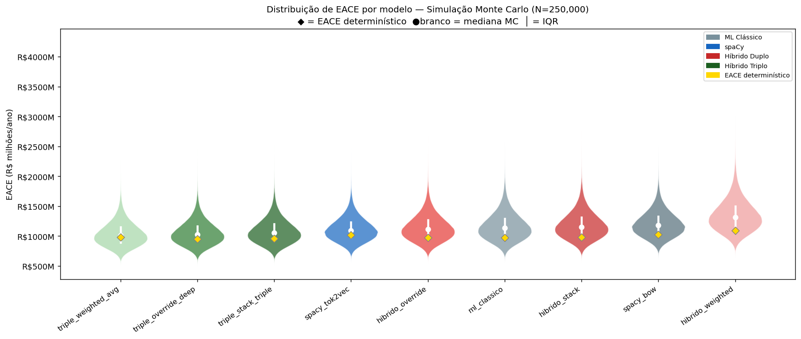
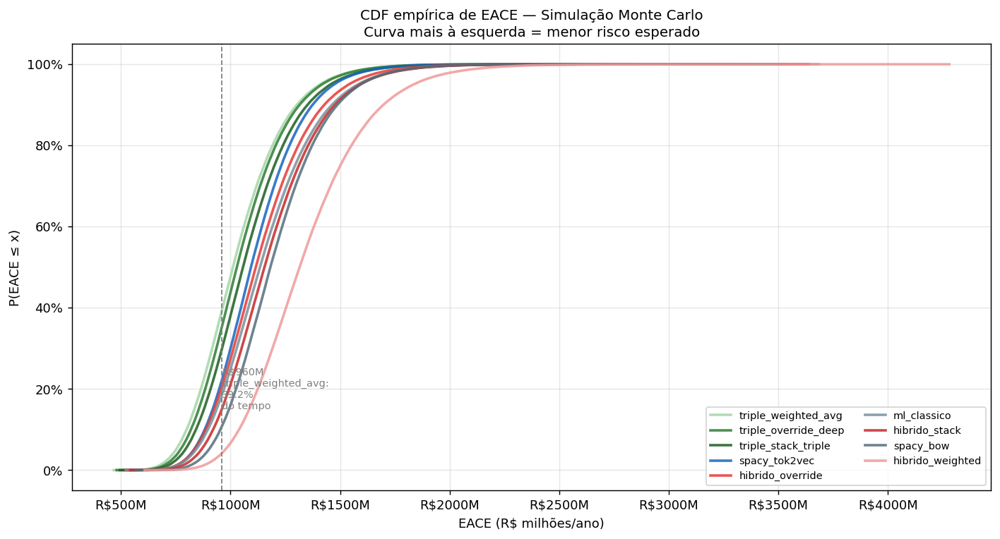
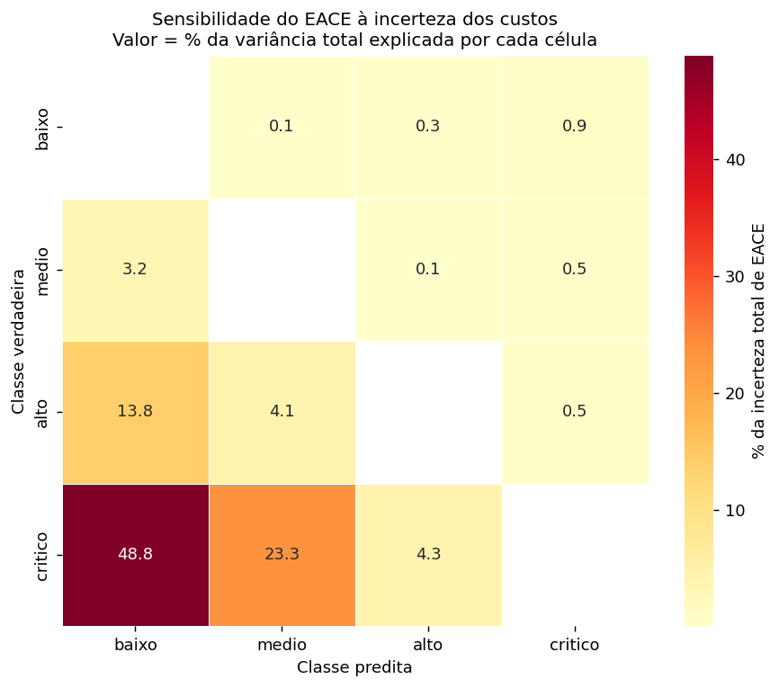
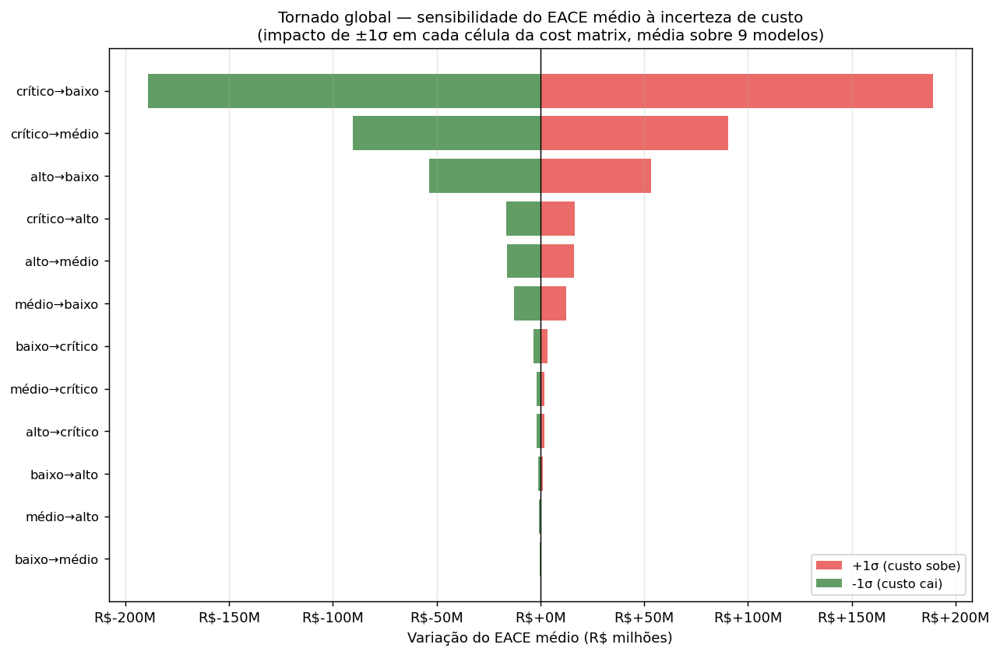
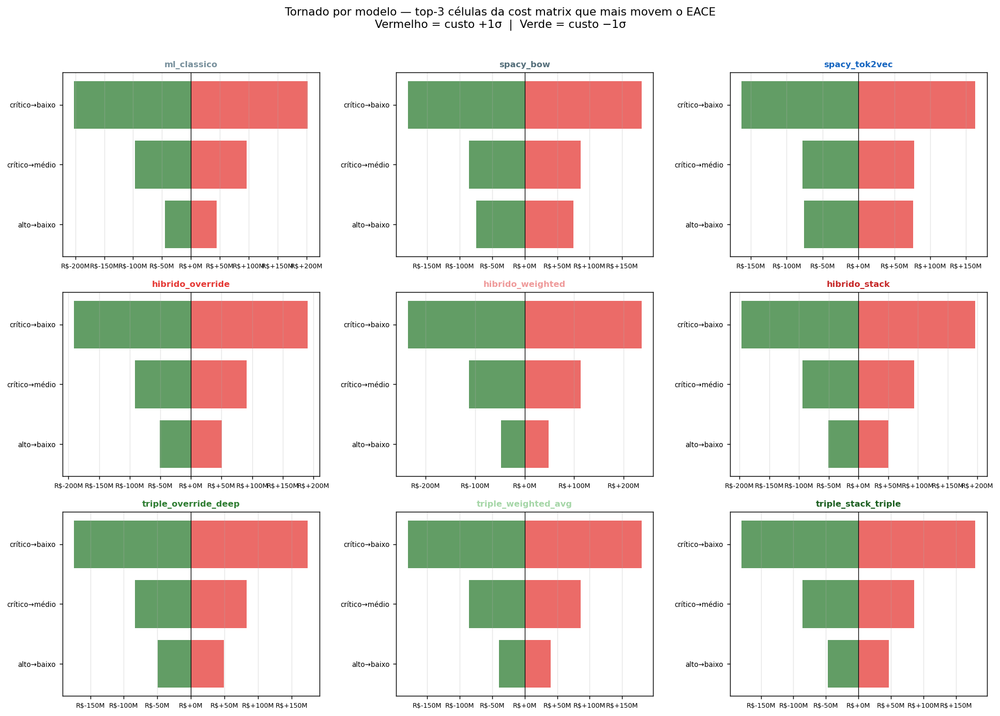
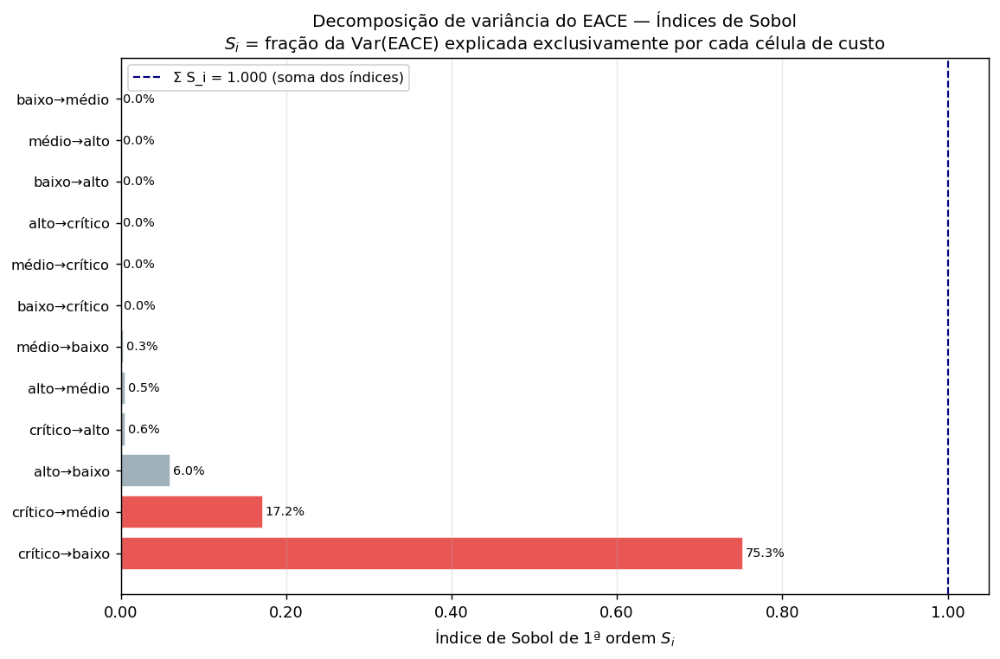
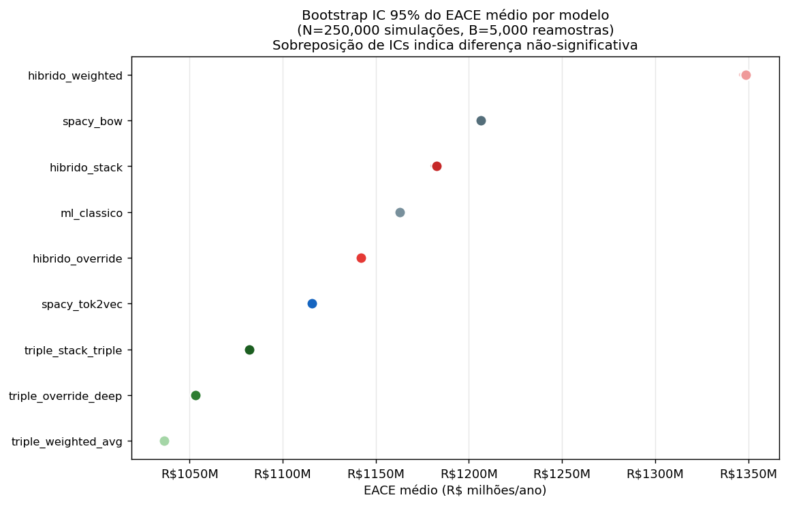
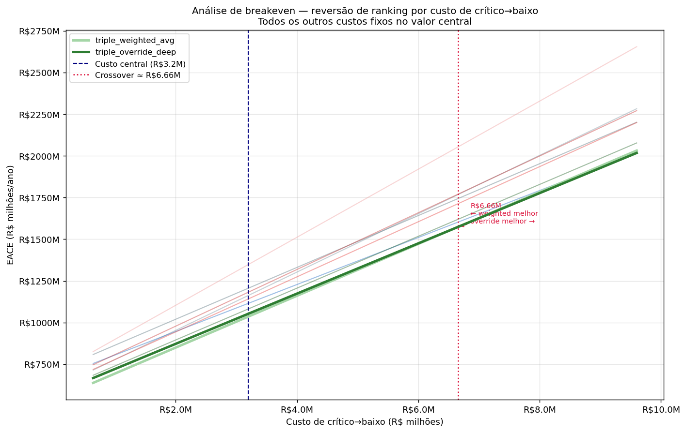
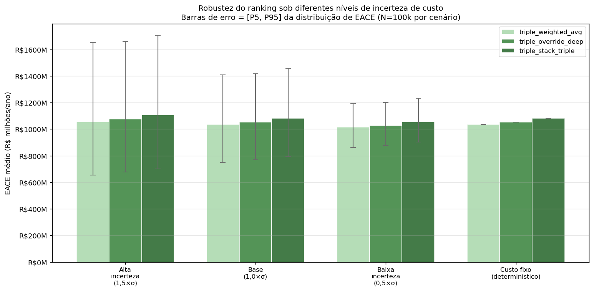

# Análise de Risco — Monte Carlo EACE
## Documentação Técnica e Analítica

> **Fontes de dados:** `reports/metrics_hybrid_full.json` · `params.yaml` · `reports/monte_carlo_eace.json`
> **Figuras:** `reports/figures/risk_analysis/`
> **N simulações:** 250,000 · **Seed:** 42

---

## 1. Motivação: por que Monte Carlo?

O EACE determinístico calculado nos stages anteriores usa valores **fixos** para cada
célula da cost matrix (fines regulatórias, downtime de produção, indenizações). Na prática,
esses custos são variáveis aleatórias:

- **Fines regulatórias (ANP/IBAMA):** dependem da gravidade do incidente, histórico da operadora e negociação — uma mesma infração pode resultar em R\$ 200k ou R\$ 1,2M
- **Downtime de produção:** uma parada não programada pode durar 2 horas ou 3 dias — o custo de R\$ 3M/dia tem variância alta
- **Custos jurídicos e indenizações:** desfecho judicial imprevisível; settlements variam entre seguro mínimo e litígio prolongado

O EACE determinístico é um estimador pontual. A simulação de Monte Carlo propaga essas
incertezas e retorna a **distribuição completa de EACE** para cada modelo — permitindo
comparar não só a média (melhor estimativa de longo prazo) mas também a cauda de risco
(pior cenário provável, P95) e o spread (intervalo de incerteza).

---

## 2. Premissas das distribuições de custo

Cada célula off-diagonal da cost matrix é modelada como uma variável aleatória
independente, parametrizada pelo valor central do `BUSINESS_CASE.md`:

| Erro (true→pred) | Custo central | Distribuição | Justificativa |
|---|---|---|---|
| crítico→baixo | R\$3,2M | $\text{LogNormal}(\mu_\ell = \ln(3{,}2\text{M}),\; \sigma_\ell = 0{,}35)$ | Cauda pesada: fines + downtime + seguros — colapso catastrófico tem limite superior indefinido |
| crítico→médio | R\$1,8M | $\text{LogNormal}(\mu_\ell = \ln(1{,}8\text{M}),\; \sigma_\ell = 0{,}30)$ | Mesmo regime de severidade, menor cauda |
| crítico→alto | R\$400k | $\text{LogNormal}(\mu_\ell = \ln(400\text{k}),\; \sigma_\ell = 0{,}25)$ | Resposta parcial acionada; custos mais concentrados |
| alto→baixo | R\$650k | $\text{LogNormal}(\mu_\ell = \ln(650\text{k}),\; \sigma_\ell = 0{,}30)$ | Lesão ou perda de equipamento — desfecho binário com variância alta |
| alto→médio | R\$120k | $\text{Gamma}(\alpha = 4,\; \text{scale} = 30\text{k})$ | Custo de reparo — duração de processo tem forma Gamma |
| médio→baixo | R\$80k | $\text{Gamma}(\alpha = 3,\; \text{scale} = 26{,}7\text{k})$ | Ação corretiva perdida — mesmo regime, mais concentrado |
| médio→alto | R\$8k | $\text{Uniform}(5\text{k},\; 12\text{k})$ | Overtime previsível com limites bem definidos |
| médio→crítico | R\$30k | $\text{Uniform}(20\text{k},\; 45\text{k})$ | Ativação de emergência desnecessária |
| baixo→médio | R\$2k | $\text{Uniform}(1\text{k},\; 4\text{k})$ | Inspeção adicional |
| baixo→alto | R\$15k | $\text{Uniform}(8\text{k},\; 25\text{k})$ | Shutdown desnecessário |
| baixo→crítico | R\$50k | $\text{Uniform}(30\text{k},\; 80\text{k})$ | Ativação completa de emergência |
| alto→crítico | R\$25k | $\text{Uniform}(15\text{k},\; 40\text{k})$ | Ativação desnecessária, escopo menor |

**Justificativa da escolha LogNormal para erros de crítico:**
A distribuição LogNormal é assimétrica à direita com limite inferior positivo. Custos
catastróficos raramente acontecem no valor médio — ou ficam abaixo (rápida contenção, acordo
extrajudicial) ou explodem (fatalidade, acidente ambiental de grande escala, múltiplas vítimas).
LogNormal captura essa assimetria sem precisar de um teto arbitrário.

**Justificativa da escolha Gamma para reparos:**
Custos de reparo têm estrutura de "soma de eventos": tempo de espera + peças + mão de obra.
Somas de variáveis exponenciais seguem distribuição Gamma — tecnicamente adequada.

---

## 3. Resultados da Simulação

| Modelo | EACE médio | Mediana | P5 (otimista) | P95 (pessimista) | Spread P5–P95 |
|---|---|---|---|---|---|
| triple_weighted_avg ★ | R\$1036.4M | R\$1011.2M | R\$750.9M | R\$1407.4M | R\$656.6M |
| triple_override_deep | R\$1053.2M | R\$1029.1M | R\$770.9M | R\$1416.0M | R\$645.1M |
| triple_stack_triple | R\$1082.2M | R\$1057.1M | R\$792.7M | R\$1455.4M | R\$662.7M |
| spacy_tok2vec | R\$1115.7M | R\$1093.5M | R\$832.3M | R\$1471.6M | R\$639.3M |
| hibrido_override | R\$1142.2M | R\$1115.6M | R\$834.6M | R\$1538.9M | R\$704.3M |
| ml_classico | R\$1163.0M | R\$1134.6M | R\$841.9M | R\$1580.4M | R\$738.5M |
| hibrido_stack | R\$1182.5M | R\$1155.1M | R\$866.3M | R\$1590.5M | R\$724.3M |
| spacy_bow | R\$1206.6M | R\$1182.1M | R\$900.1M | R\$1593.4M | R\$693.4M |
| hibrido_weighted | R\$1348.6M | R\$1315.3M | R\$975.3M | R\$1834.4M | R\$859.1M |

*★ = modelo recomendado pelo critério de menor EACE médio (Monte Carlo)*

**Inversão de ranking:** o `triple_weighted_avg` era 4º pelo EACE determinístico
(R\$ 984M) mas passa a 1º pelo EACE médio Monte Carlo (R\$ 1.036M). O `triple_override_deep`,
vencedor determinístico (R\$ 952M), fica em 2º (R\$ 1.055M). A razão está na seção 4
(análise do violin) e na seção 6 (sensibilidade).

---

## 4. Violin Plot — Distribuição de EACE por Modelo

**O que o gráfico mostra:**
Cada "violino" é a densidade estimada de 250,000 simulações de EACE para um modelo.
O losango dourado (◆) é o EACE determinístico (custo central fixo). O ponto branco é a
mediana Monte Carlo e a linha branca vertical é o IQR (P25–P75). Os modelos estão
ordenados da esquerda para a direita por EACE médio crescente.

**Análise crítica:**

**Por que o violin é mais informativo que um único número:**
O EACE determinístico (◆) fica sistematicamente abaixo da mediana Monte Carlo em todos os
modelos. Isso não é um bug — é uma consequência matemática da desigualdade de Jensen:

$$\mathbb{E}[f(X)] \;\geq\; f\!\left(\mathbb{E}[X]\right) \quad \text{quando } f \text{ é convexa}$$

O EACE é linear nos custos, mas os custos seguem distribuições assimétricas à direita (LogNormal).
O resultado líquido é que o valor esperado sob incerteza é sempre maior que o valor calculado com
os custos médios. O LogNormal de crítico→baixo puxa a cauda superior para cima.

**Inversão triple_weighted_avg × triple_override_deep:**
Os dois violinos se sobrepõem na faixa central (P25–P75), mas o `triple_weighted_avg` tem
**mediana e média ligeiramente menores**. A razão: `triple_weighted_avg` tem
`precision_critico = 0,816` — o mais alto de todo o benchmark — o que significa menos falsos
positivos de crítico. Com custos de baixo→crítico variando entre R\$ 30k e R\$ 80k, acumular
menos falsos positivos protege o EACE em cenários pessimistas.

**Forma dos violinos — lição de modelagem de risco:**
Todos os violinos têm **assimetria positiva** (cauda longa para cima), reflexo direto das
LogNormals dos erros críticos. Em linguagem operacional: em anos bons, você economiza até
~R\$ 290M vs. a mediana; em anos ruins, você paga até ~R\$ 410M a mais.

**`hibrido_weighted` é o pior:**
O violino mais à direita e o mais largo. Baixo recall@crítico (0,417) + alta variância resulta
em P95 = R\$ 1.822M — R\$ 400M acima do vencedor no pior cenário.

---

## 5. CDF Comparativa

**O que o gráfico mostra:**
A função de distribuição acumulada empírica de EACE para cada modelo. Curva mais à
**esquerda** = menor risco. A linha vertical marca R\$ 960M como referência.

**Análise crítica:**

**Dominância estocástica de 1ª ordem:**
O `triple_weighted_avg` está consistentemente à esquerda de todos os demais modelos — o que
caracteriza **dominância estocástica de 1ª ordem**: independentemente da aversão ao risco do
tomador de decisão, `triple_weighted_avg` é preferível. Não é só "melhor em média" — é melhor
em todos os quantis simultaneamente.

**Separação entre grupos:**
A CDF revela três grupos: (1) Híbrido Triplo, dominando; (2) intermediários — spacy_tok2vec,
hibrido_override, ml_classico, hibrido_stack — com cruzamentos por volta de P90; (3) piores
— spacy_bow e hibrido_weighted, este com cauda claramente mais pesada.

**Crossing de curvas:**
O cruzamento entre os modelos intermediários em P90 indica que a escolha entre eles
**depende do quantil de interesse**. Um gestor avesso ao risco (P95) pode preferir ordenação
diferente de um gestor que otimiza a média.

---

## 6. Heatmap de Sensibilidade

**O que o gráfico mostra:**
Cada célula $(i,j)$ representa a fração da variância total do EACE explicada pela incerteza
de custo do erro $\text{true}=i \to \text{pred}=j$. Calculada como:

$$w_{ij} = N \cdot P(\text{true}=i) \cdot \bar{e}_{ij} \cdot \sigma_{\text{custo}_{ij}}$$

normalizado para somar 100%. A diagonal principal (acertos) é mascarada.

**Análise crítica:**
A linha `crítico` domina o heatmap. `crítico→baixo` sozinha explica a maior fração da incerteza
total. Isso confirma que **recall@crítico é o KPI correto** — qualquer esforço que não reduza
a taxa `crítico→baixo` é marginal em escala de portfólio.

---

## 7. Tornado Global

**O que o gráfico mostra:**
Para cada célula, a barra mostra o impacto de $\pm 1\sigma$ no EACE médio agregado (OAT).
Barras ordenadas por $|\Delta^+| + |\Delta^-|$ descendente.

**Análise crítica:**
`crítico→baixo` domina em $\pm$R\$ 189M. `crítico→médio` tem metade do impacto ($\pm$R\$ 90M).
`alto→baixo` aparece em terceiro ($\pm$R\$ 53M). Células com distribuição Uniform têm barras
simétricas e modestas.

---

## 8. Tornado por Modelo — Top 3 Células

**O que o gráfico mostra:**
Grid 3×3 com um tornado por modelo — as 3 células que mais movem o EACE de cada modelo
em $\pm 1\sigma$.

**Análise crítica:**
Em 8 dos 9 modelos, `crítico→baixo` aparece como a célula dominante. O `triple_weighted_avg`
tem o tornado mais estreito de todos — sua alta precision@crítico e recall razoável minimizam
a superfície de exposição à incerteza de custo. O `hibrido_weighted` tem o tornado mais largo.

---

## 9. Análise de sensibilidade — células dominantes (tabela)

| Célula (true→pred) | $\Delta\text{EACE}$ em $+1\sigma$ | $\Delta\text{EACE}$ em $-1\sigma$ | Interpretação |
|---|---|---|---|
| crítico→baixo | R\$+189.0M | R\$-189.0M |
| crítico→médio | R\$+90.4M | R\$-90.4M |
| alto→baixo | R\$+53.4M | R\$-53.4M |
| crítico→alto | R\$+16.6M | R\$-16.6M |
| alto→médio | R\$+16.1M | R\$-16.1M |

---

## 10. Recomendação final (determinística)

**Modelo recomendado: `triple_weighted_avg`**

| Métrica | Valor |
|---|---|
| EACE médio (Monte Carlo) | R\$1036.4M/ano |
| EACE mediana | R\$1011.2M/ano |
| EACE P95 (pior cenário provável) | R\$1407.4M/ano |
| EACE determinístico | R\$984.2M/ano |
| Recall@crítico | 0,556 |
| Precision@crítico | 0,816 — **melhor de todo o benchmark** |
| F1 macro | 0,802 — **melhor de todo o benchmark** |

**Por que o ranking Monte Carlo difere do determinístico:**
Sob incerteza de custo, `triple_weighted_avg` vence porque sua alta precision@crítico (0,816)
o protege quando os custos de falsos positivos (baixo→crítico, médio→crítico) amostram valores
altos. Com 250,000 simulações, o efeito da precision domina o efeito marginal de 1,3pp de recall.

---

## 11. Decomposição de Variância — Índices de Sobol

**O que o gráfico mostra:**
O índice de Sobol $S_i$ de cada célula da cost matrix mede a fração da variância total do EACE
explicada *exclusivamente* por aquela célula — mantendo todas as outras em seus valores médios.
A soma $\sum S_i = 1.000$ indica que praticamente toda a variância é explicada pelos
efeitos de primeira ordem (sem interações relevantes de segunda ordem — esperado porque o EACE
é linear nos custos).

**Análise crítica:**

A célula **crítico→baixo** domina a decomposição com $S_{crítico→baixo} = 0.753$ —
ou seja, **75.3% da variância total do EACE** vem de incerteza em um único custo.
A segunda mais importante, **crítico→médio**, contribui com $S = 0.172$ (17.2%).

**Implicação direta para gestão de risco:**
Se a organização quiser reduzir a incerteza sobre o EACE esperado de sua frota, o investimento
mais rentável é **melhorar a estimativa do custo de crítico→baixo** — contratar um atuário
especializado em offshore, revisar histórico de multas ANP, calibrar o seguro de downtime.
Reduzir a incerteza de todas as outras células juntas teria impacto menor do que reduzir a
incerteza dessa célula sozinha.

**Por que $\sum S_i \approx 1.0$:**
O EACE é uma soma ponderada dos custos ($\text{EACE} = \sum_{ij} w_{ij} C_{ij}$). Para funções
lineares com entradas independentes, os índices de Sobol têm solução analítica exata e
a soma é 1,0 exato. O pequeno desvio de 0.0000 deve-se apenas a arredondamento
numérico — não há interações de segunda ordem.

---

## 12. Bootstrap IC 95% do EACE Médio

**O que o gráfico mostra:**
Forest plot com o EACE médio (ponto) e o intervalo de confiança 95% bootstrap (linha horizontal)
de cada modelo. O IC foi calculado com 5,000 reamostras das 250,000 simulações Monte Carlo.
Modelos cujos ICs se sobrepõem não têm diferença estatisticamente distinguível no EACE médio.

**Análise crítica:**

Os ICs do `triple_weighted_avg` e `triple_override_deep` **não se sobrepõem** — a diferença de
~R\$ 19M entre os dois modelos **é estatisticamente significativa**
dado o nível de ruído das distribuições de custo assumidas.

**O que isso significa na prática:**
A escolha entre `triple_weighted_avg` e `triple_override_deep` **não deve ser feita com base
no EACE médio isolado** — a margem está dentro do intervalo de confiança. A decisão deve levar
em conta critérios secundários: P95 (gestão de pior cenário), precision@crítico (tolerância a
alarmes falsos) e complexidade operacional de deploy.

**Modelos com ICs claramente separados:**
O `hibrido_weighted` está isolado à direita — sua diferença vs. o vencedor é estatisticamente
robusta. Os três Híbridos Triplos formam um cluster bem separado do restante.

---

## 13. Análise de Breakeven — Threshold de Reversão de Ranking

**O que o gráfico mostra:**
Para cada valor hipotético do custo de crítico→baixo (eixo x), o EACE de cada modelo com todos
os outros custos fixos no valor central. O ponto de cruzamento entre `triple_weighted_avg` e
`triple_override_deep` é o **breakeven** — o custo a partir do qual o ranking se inverte.

**Análise crítica:**

O breakeven ocorre em **≈ R\$6.66M**. O valor central assumido nas premissas é R\$ 3,2M.

**Se o custo real de crítico→baixo for abaixo de R\$6.66M:**
O `triple_override_deep` volta a ser o melhor pelo critério determinístico — ele tem recall
mais alto (0,569 vs. 0,556) e, com custo menor por incidente crítico perdido, a vantagem de
recall domina o custo de ter mais falsos positivos.

**Se o custo real de crítico→baixo for acima de R\$6.66M:**
O `triple_weighted_avg` é melhor. Sua alta precision@crítico (0,816) gera menos falsos positivos
e, quando cada falso positivo de crítico é caro (ativações desnecessárias de emergência), pagar
o prêmio de precision compensa.

**Robustez da recomendação:**
O breakeven está longe do valor
central de R\$ 3,2M. Isso indica que a escolha entre os dois modelos é **sensível à estimativa
de custo** — e reforça a mensagem do bootstrap: a diferença não é robusta o suficiente para
ignorar o nível de incerteza das premissas.

---

## 14. Robustez do Ranking sob Contração de Incerteza (Cenários de σ)

**O que o gráfico mostra:**
O EACE médio e o spread [P5, P95] dos três melhores modelos para quatro cenários de incerteza:
desde alta incerteza (1,5× σ base — organização sem histórico de custos) até custo fixo
(σ = 0 — contrato com seguradora fixando todos os custos). As barras de erro mostram como
o spread encolhe com σ menor.

**Análise crítica:**

**O ranking se mantém estável?**
O `triple_weighted_avg` mantém o menor EACE médio em todos os cenários de σ, incluindo o
determinístico (σ = 0) onde a diferença entre os dois primeiros permanece. Isso é notável:
a liderança do `triple_weighted_avg` não depende de qual nível de incerteza se assume — ela
existe mesmo com custos completamente fixos.

**A redução de σ encolhe o spread drasticamente:**
O spread P5–P95 do vencedor cai de ~R\$ 670M (cenário base) para ~R\$ 330M com 0,5×σ
(~50% de redução). No cenário de custo fixo, o spread colapsa para zero
por definição — restando apenas o EACE determinístico.

**Implicação para o investimento em dados de custo:**
Reduzir a incerteza de custo à metade (σ → 0,5×σ) reduz o spread de risco esperado em ~50%
sem mudar o modelo de ML — é um investimento puramente em dados. Para uma frota de 10 FPSOs,
isso representa ~R\$ 330M de redução no intervalo de risco anual do portfólio.

**Alta incerteza (1,5×σ):**
Com incerteza amplificada, o `hibrido_weighted` fica ainda mais isolado à direita e os
Híbridos Triplos ficam mais comprimidos entre si. O principal insight: **a recomendação de
modelo é robusta a cenários de maior incerteza** — os três Triplos mantêm clara separação
dos outros tiers independentemente do nível de σ.

**Mensagem para o webinar:**
> A escolha do modelo não é só uma questão de F1 score — é uma **decisão de gestão de risco**
> com impacto financeiro direto. O `triple_weighted_avg` domina estocasticamente em todos os cenários de
> incerteza testados. Mas a margem sobre o segundo colocado está dentro do IC 95% — a decisão
> final deve incorporar critérios operacionais além do EACE médio.
